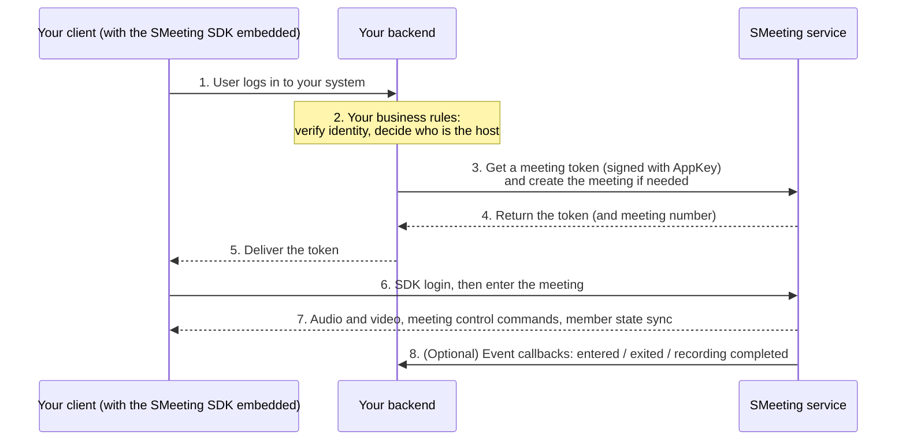

This page gives you the shortest path to integrating SMeeting. First understand who does what, then pick an integration option and follow it.

---

## Who does what

An integration involves four parties: **two are yours, and two are ours**.

| Party | Owner | Responsible for |
| --- | --- | --- |
| **Your client** | You | Meeting UI and interaction: entry buttons, video layout, member list, meeting control buttons. Audio, video, and meeting control capabilities come from our embedded SDK |
| **Your backend** | You | User system and business rules: who is a valid user, when to create a meeting, who is the host. Calls our server API with the `AppKey` |
| **Our SDK** | Us | Capture, encoding and decoding, transport, signaling, meeting state synchronization, event callbacks. It is a library that runs inside your client |
| **Our server** | Us | Media forwarding, meeting and meeting control state, recording / live streaming, plus the server API and event callbacks for your backend |

Remember the boundary in one sentence: **we don't touch your user system, and you don't touch the media streams.**

+ SMeeting has no user system of its own—`user_id` is simply the existing user ID from your business system, and when the same user enters a meeting from multiple devices at once, we tell them apart automatically
+ Audio and video data doesn't pass through your servers—clients connect directly to our media service, so meetings don't increase your bandwidth bill
+ Meeting control rules such as host, raise hand, mute all, and waiting room are already implemented, so you don't have to write them again



Across the whole flow, **your backend "issues the key," and your client "uses the key"**: media goes through us, and business decisions go through you.

---

## Three integration options

The diagram above shows the third option, which takes the most effort and gives the most freedom. In practice, you can hand the UI part over to us. From least to most effort:

| Option | What you do | UI | Best for |
| --- | --- | --- | --- |
| **Server-side low-code integration** | Your backend calls three endpoints and builds a URL | Deployed by us | Attaching meetings to an existing business workflow (reviews, tickets, tendering and bidding) |
| **Low-code integration with UI** | Take our frontend source code, modify it, and deploy it yourself | Our source code, which you can modify | Your own branding with light customization |
| **Custom integration** | Integrate the SDKs for each platform and build your own UI | Entirely your own | Building a meeting product with deeply customized interactions |

### Server-side low-code integration

**No SDK to integrate, no meeting UI to build.** The meeting client, user system, and login state are all deployed by us. Your backend does only three things:

```text
When a business activity is created
  └─ POST /server/v1/meet/create          attach your business document number → get room_no

When the user clicks "Enter meeting"
  ├─ POST /stm/srvapi/v1/member/grant     user_id + nickname → token (the user is created on the spot if missing)
  └─ 302 redirect /stm/ui/outer?token=&room_no=
```

See [Server-side low-code integration](/zh/meeting/ui-sdk/server-integration) (Chinese).

### Low-code integration with UI

The meeting UI uses our frontend source code; you change the styles and deploy it yourself. Your backend still connects accounts with ours, and you don't need to touch the meeting logic. See [Low-code integration with UI](/zh/meeting/ui-sdk/web) (Chinese).

### Custom integration

Integrate the SDKs for each platform, build your own UI, and call meeting controls, recording, and member management as needed. This is the path shown in the sequence diagram above; the platform links below are where this path starts.

---

## Before you start

<Steps>
<Step title="Create an app">
Get an **AppID** and an **AppKey**. The AppKey is a server-side secret key and must never be put in the client—see [Token and authentication](/en/meeting/token).
</Step>

<Step title="Choose an integration option">
Start with the table above. If all you need is to "add a meeting entry to this review," server-side low-code integration can be up and running the same day; go with custom integration if you are building a meeting product. For a detailed comparison of the three, see [Overview](/en/meeting/overview#three-integration-options).
</Step>

<Step title="Set up token issuing">
Step 3 of the sequence diagram is **the only server-side code you must write** for custom integration: after verifying your own user's identity, sign a call to the grant endpoint with the AppKey and return the token to the client. After that, the flow in every platform's SDK is `login(token)` → create / query a meeting → enter the meeting.
</Step>
</Steps>

---

## Choose your platform

| Platform | Start here |
| --- | --- |
| Web | [Integration](/en/meeting/web/integration) · [Quickstart](/en/meeting/web/quickstart) |
| Android | [Integration](/en/meeting/android/integration) · [Quickstart](/en/meeting/android/quickstart) |
| Windows | [Integration](/zh/meeting/windows/integration) (Chinese) · [Quickstart](/zh/meeting/windows/quickstart) (Chinese) |
| Swift (iOS / macOS) | [Integration](/en/meeting/swift/integration) · [Quickstart](/en/meeting/swift/quickstart) |
| iOS (Objective-C) | [Quickstart](/zh/meeting/ios/quickstart) (Chinese) |
| Server | [Server API](/en/meeting/server-api/overview) |

---

## Common questions about the boundaries

**Does audio and video go through my servers?** No. Clients connect directly to our media service; your backend only takes part in authentication and business decisions.

**Do users have to register with you first?** No. Use your own user ID as `user_id`; we don't store your user profiles.

**What happens if the AppKey is in the frontend?** Anyone who gets it can grant any user access to any meeting, remove members, and end meetings. It must stay on the server.

**Can I define my own in-meeting roles?** Yes. By default you use our three built-in tiers (regular member / host / co-host); if they are enough, you don't need to do anything. You can also disable the built-in roles entirely and replace them with a role system defined by your business. For tendering and bidding, we already have a standard product with customized roles that you can use directly. See [Key concepts · Custom roles](/en/meeting/key-concepts#custom-roles).

**How does my backend know what happens in a meeting?** Register callbacks—no polling needed. See the [callback events guide](/en/meeting/server-api/guides/callbacks).
