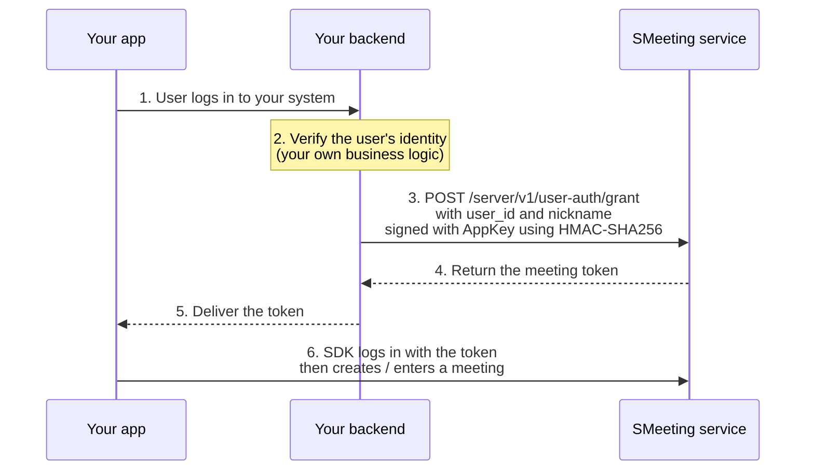

A client needs a token to log in to SMeeting. This token **can only be issued by your backend**; it cannot be generated on the client. This page walks through the whole flow.

---

## AppID and AppKey

When you create an app, you get a pair of credentials with completely different purposes:

| Credential | Purpose | Allowed on the client |
| --- | --- | --- |
| **AppID** | Identifies your app | Yes |
| **AppKey** | Secret key for signing server API calls | **Never** |

<Warning>
**A leaked AppKey means your app is taken over.** Anyone who gets it can grant any user access to any meeting, remove members, and end meetings.

It must not appear in client code, frontend config files, mobile app packages, Git repositories, or logs. It may only exist on your own server.
</Warning>

---

## Grant flow



The key is step 2: **SMeeting doesn't manage your user system**. Your backend decides who is a valid user; SMeeting only trusts the issued token and the `user_id` inside it.

Use the user ID from your business system as `user_id`—when the same user enters a meeting from multiple devices at once, SMeeting tells them apart automatically, so you don't need to build a unique value yourself.

For endpoint details, see [Server API · Meeting authorization](/en/meeting/server-api/user-auth); for the signing algorithm, see the [Server API overview](/en/meeting/server-api/overview).

---

## After login

Getting the token is only the first step. The flow in every platform's SDK is:

```text
login(token)  →  create / query a meeting  →  enter the meeting
```

Login establishes a **user session**, not a meeting connection. You can call the meeting management APIs only after login succeeds, and the in-meeting APIs only after entering the meeting.

To invalidate a user immediately (for example, when you disable them in your system), call the server's "Log out a user" endpoint. Their session is invalidated at once, and they need a new grant the next time they call an API.

---

## Secret key security checklist

Check the following before going live:

+ Is the AppKey stored only in server environment variables or a secret management service?
+ Grep your frontend build output for the AppKey to confirm it wasn't bundled in
+ Does your token-issuing backend endpoint verify its own login state? Otherwise anyone can exchange someone else's `user_id` for a token
+ Do your logs print the AppKey or full tokens?

<Warning>
The third item is the easiest to miss. If the issuing endpoint doesn't verify the caller's identity, you are exposing the ability to "enter meetings as any user" to the public internet.
</Warning>

---

## Related

+ [Key concepts](/en/meeting/key-concepts)—rooms, meetings, members, and roles
+ [Server API overview](/en/meeting/server-api/overview)—signing algorithm and request format
