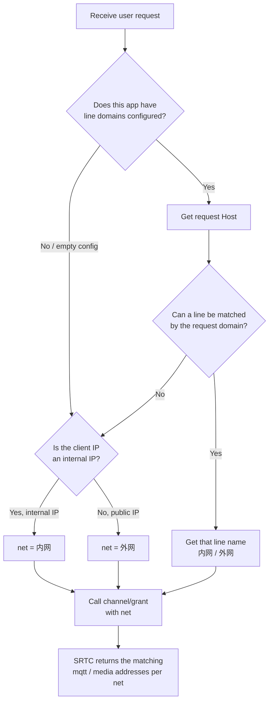

> This page is for partners integrating with our RTC service (at the server application layer). It explains what the `net` parameter of the RTC grant endpoint `channel/grant` means, and how your own backend decides whether a user should use the `内网` (internal network) or `外网` (public network) line.

---

## 1. The `net` parameter

- `net` is defined on the RTC service we (the RTC layer) have deployed, and generally supports two values: **`内网`** (internal network) and **`外网`** (public network). (You can configure one or more network lines according to your scenarios.)
- When you call the grant endpoint **without `net`, it defaults to `内网`**.
- Based on this parameter, we (RTC) decide the **actual service addresses** returned to the client SDK, including the API service, channel control messaging service, media service, and more.
- In other words: **whether the client ends up connecting to internal or public addresses is decided entirely by this single `net` field**. If you pass the wrong value, the client gets the wrong addresses and either can't connect or takes the wrong line.

---

## 2. What you (the integrating party) need to do

When calling our RTC grant endpoint `channel/grant`, you must include the agreed `net` value (`内网` or `外网`) in the request.

It comes down to one question: **how does your backend know whether to fill in `内网` or `外网` for this request?**

---

## 3. Two ways to determine `net` (pick one)

### Option A: The user chooses manually

```text
The client lists all lines (internal / public)
  → The user confirms which line they are on
  → The client sends the choice to your backend
  → Your backend calls our channel/grant with net
```

- Pros: The most accurate; doesn't depend on any network detection.
- Cons: The user has to choose each time, which adds friction for users, and the user may choose wrong.

### Option B: Your backend decides automatically (recommended; you can refer to our demo implementation)

```text
Your backend receives a request from its own user
  → Automatically determines whether the user is internal or public
  → Calls our channel/grant with net
```

- Pros: Invisible to the user; traffic is routed automatically.
- Cons: You need to implement a short piece of decision logic in your backend (the logic is simple; see the pseudocode below).

> Note: The demo in this project is a **reference implementation of the server application layer**, and it uses Option B internally to determine `net`. You don't have to use the demo—just compute `net` in your own backend with the same logic, and then call our `channel/grant`.

---

## 4. Line decision flowchart



> Matching rule: "a line is matched by the request domain" in the decision node means **the request Host contains the domain string configured for that line** (substring match, not exact equality). For example, if a line is configured with `example.com`, then `meeting.example.com` also matches that line.

---

## 5. `matchNetwork` logic (pseudocode)

The decision logic for Option B is as follows and can be ported directly to any language:

```text
function matchNetwork(request):
    # 1. Read this app's line config (from your own config file; may be empty)
    #    Config format: lineName@domain1,domain2;lineName@domain3
    #    Example: "内网@lan.example.com;外网@wan.example.com"
    #    Note: the config may be missing/empty; in that case go straight to the step 3 fallback
    config = readLineConfig(appId)

    # 2. If lines are configured, match by request domain
    if config is not empty:
        lineMap = parse(config)        # Parse into {lineName: [domain...]}
        host = request.host
        for lineName, domains in lineMap:
            for domain in domains:
                if host contains domain:
                    return lineName     # Return the matching line (内网/外网) on the first hit

    # 3. Not configured or no domain matched: fall back to the client IP
    clientIP = request.clientIP
    if isInternalIP(clientIP):
        return "内网"
    else:
        return "外网"

function isInternalIP(ip):
    # Any of the following counts as internal
    return ip in 10.0.0.0/8        # Private address, class A
        or ip in 172.16.0.0/12     # Private address, class B
        or ip in 192.168.0.0/16    # Private address, class C
        or ip in 127.0.0.0/8       # Loopback address
        or ip in 100.64.0.0/10     # Carrier-grade NAT (CGNAT)
```

**Key points**:

1. Match by the **access domain** first—you configure a different entry domain for each line, and whichever domain the user comes in through decides the line. This is the most accurate.
2. If no domain is configured or none matches, fall back to the **client IP**: internal IP → `内网`, public IP → `外网`.
3. The `net` you finally pass to us can only be `内网` or `外网`.

> Note: The line names and domains in the pseudocode above are only format examples. Real values come from your own config file, and the config file may be empty (in which case step 3, the IP fallback, is used).

---

## 6. Alignment and notes

1. The `net` you pass to us **must be `内网` or `外网`**; if omitted it defaults to `内网`. Don't pass any other value that hasn't been agreed on.
2. If your network environment is simple and your users' origins are clear, **Option B (domain matching + IP fallback)** is the least effort—just implement the pseudocode above.
3. If the boundary between your internal and public networks is complex and automatic detection is prone to errors, we recommend **Option A (manual selection by the user)**, which is the least error-prone.
4. Before going live, we recommend verifying once each with an internal user and a public user, to confirm the `mqtt` and media addresses they actually receive are as expected.

---

## 7. Reverse proxy (Nginx) considerations

The line decision above relies on two key pieces of information: **the request domain `Host`** (for domain matching) and **the client's real IP** (for the internal/public fallback). If your service sits behind a reverse proxy such as Nginx, it must forward both correctly; otherwise domain matching gets the proxy's domain, and the IP fallback sees the proxy's internal IP and picks the wrong line.

Key Nginx configuration example:

```nginx
proxy_set_header Host $host;
proxy_set_header X-Real-IP $remote_addr;
proxy_set_header X-Forwarded-For $proxy_add_x_forwarded_for;
proxy_set_header X-Forwarded-Proto $scheme;
```

What each directive does:

- `Host $host`: Passes the domain the user actually accessed to the backend, so the domain matching logic gets the real entry domain.
- `X-Real-IP $remote_addr`: Passes the client's real IP.
- `X-Forwarded-For $proxy_add_x_forwarded_for`: Appends the client IP to the forwarding chain, so the backend can get the real IP from trusted headers.
- `X-Forwarded-Proto $scheme`: Passes the original access protocol (http/https), in case you have protocol-dependent logic.

> Tip: When the backend gets the client IP, it should read trusted headers such as `X-Real-IP` / `X-Forwarded-For` first (and trust them only from proxy sources), rather than the TCP peer address; otherwise you get Nginx's IP instead of the user's.
