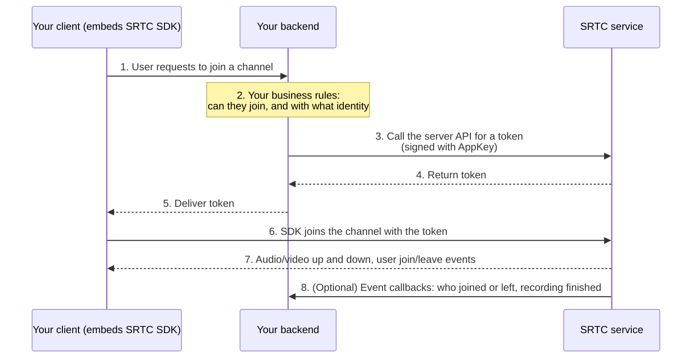

This page gives the shortest path to integrating SRTC. Understand the division of responsibilities first, then follow your platform's entry point.

---

## Who does what

An integration involves four roles: **two are yours, and two are ours**.

| Role | Owner | Responsibilities |
| --- | --- | --- |
| **Your client** | You | UI and interaction: entry buttons, video layout, user list, button states. Audio and video capabilities come from embedding our SDK |
| **Your backend** | You | User system and business rules: who is a valid user, and who can join this channel. Calls our server API with the `AppKey` |
| **Our SDK** | Us | Capture, encoding and decoding, transport, signaling, state sync, event callbacks. It is a library that runs inside your client |
| **Our server** | Us | Media forwarding, session state, recording / live streaming / re-streaming, and the server API your backend calls |

Remember this boundary in one sentence: **we don't touch your user system, and you don't touch the media streams.**

+ You don't need to register users with us—use the user IDs your system already has as `uid`
+ Audio and video data doesn't pass through your servers—clients connect directly to our media service, so your bandwidth bill doesn't grow because of calls



Across the whole flow, **your backend "issues the key" and your client "uses the key"**. Media goes through us; business decisions stay with you.

---

## Before you start

Complete these three things in order, then go to your platform's docs:

<Steps>
<Step title="Create an app">
Get an **AppID** and **AppKey**. The AppKey is a server-side secret key and must never be put in a client—see [Token and authentication](/en/rtc/token).
</Step>

<Step title="Understand the model">
SRTC has only three objects: channel, user, and track. It has no user system and no business rules. Spend five minutes reading [Key concepts](/en/rtc/key-concepts), and every API after that will be much easier to follow.
</Step>

<Step title="Get token issuance working">
Step 3 in the diagram above is **the only server code you must write** in the whole integration: after verifying your own user's identity, sign a request with the AppKey to call our grant endpoint, and return the token to the client.

While debugging, you can generate a temporary token in the developer console to get the client working first; production must issue tokens from your backend. For how to wrap this on the backend and where to draw permission boundaries, see [Reference backend implementation](/en/rtc/server-api/server-demo).
</Step>
</Steps>

---

## Choose your platform

| Platform | Entry point |
| --- | --- |
| Web | [Integration](/en/rtc/web/integration) · [Quickstart](/en/rtc/web/quickstart) |
| Android | [Integration](/en/rtc/android/integration) · [Quickstart](/en/rtc/android/quickstart) |
| Windows | [Integration](/zh/rtc/windows/integration) (Chinese) · [Quickstart](/zh/rtc/windows/quickstart) (Chinese) |
| Swift (iOS / macOS) | [Integration](/en/rtc/swift/integration) · [Quickstart](/en/rtc/swift/quickstart) |
| iOS (Objective-C) | [Integration](/zh/rtc/ios/integration) (Chinese) · [Quickstart](/zh/rtc/ios/quickstart) (Chinese) |
| C (server / embedded) | [Integration](/en/rtc/capi/integration) · [Quickstart](/en/rtc/capi/quickstart) |
| Python (server-side AI) | [Integration](/en/rtc/python/integration) · [Quickstart](/en/rtc/python/quickstart) |
| Server | [Server API](/en/rtc/server-api/overview) |

<Note>
For WeChat Mini Program, we recommend embedding a page built with the Web SDK via `<web-view>`, so one codebase covers both browsers and Mini Programs. See [Web SDK integration](/en/rtc/web/integration).
</Note>

---

## Typical call order

API names differ across platforms, but the flow is the same:

```text
Initialize the SDK
  → Set event callbacks     (must be before joining the channel, or you miss early events)
  → Join the channel (with the token)
  → Capture and publish local tracks
  → Subscribe to remote tracks and render them
  → Leave the channel → Release resources
```

<Tip>
The most common pitfall is **registering callbacks after joining the channel**—you then miss the batch of "users already in the channel" events; the symptom is that you can't see anyone else after joining. Every platform's quickstart shows the correct order.
</Tip>

---

## Common questions about the boundary

**Does audio and video go through my servers?** No. Clients connect directly to our media service; your backend only handles authentication and business decisions.

**Do users need to register with you first?** No. We don't store your user data; use your own user ID as the `uid`.

**What happens if the AppKey is in the frontend?** Anyone who gets it can issue tokens for any user identity, remove users, and destroy channels. It must stay on the server.

**Who enforces permission rules?** You. We only trust what's written in the issued token; "can this person join this channel" is the decision your backend makes in step 2.

---

## If you're building a meeting product

Host, raise hand, mute all, and waiting room are not part of SRTC; you have to implement them yourself. If your product is a meeting product to begin with, read [Choosing SRTC or SMeeting](/en/choose) before deciding which layer to integrate with.
