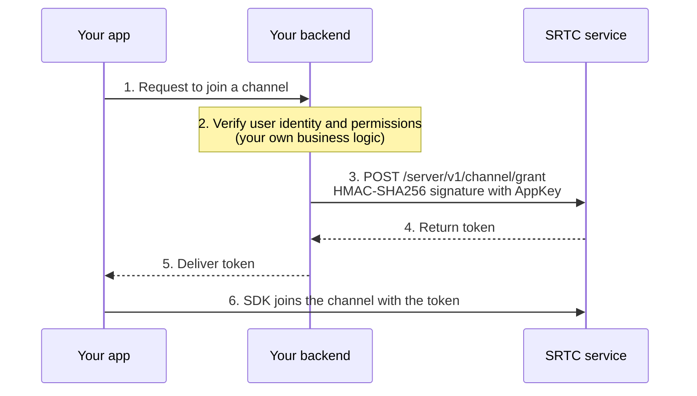

A client needs a token to join a channel. This token **can only be issued by your backend**; it can't be generated on the client. This page explains the whole flow.

---

## AppID and AppKey

After you create an app, you get a pair of credentials with completely different responsibilities:

| Credential | Purpose | Allowed on the client |
| --- | --- | --- |
| **AppID** | Identifies your app | Yes |
| **AppKey** | Secret key for signing server API calls | **Never** |

<Warning>
**A leaked AppKey means your app is taken over.** Anyone who gets it can issue tokens for any user identity, remove users, and destroy channels.

It must not appear in client code, frontend config files, mobile app packages, Git repositories, or logs. It may only exist on your own server.
</Warning>

---

## Issuance flow

The key is step 2: **SRTC doesn't manage your user system**. Who is allowed into this channel and what identity they have once inside are entirely decided by your backend. SRTC only trusts the issued token.

For endpoint details, see [Server API · Get a channel join token](/en/rtc/server-api/channel); for the signing algorithm, see [Server API overview](/en/rtc/server-api/overview).

<Tip>
If you don't want to set up a backend while debugging, you can generate a temporary token directly in the developer console to get the client flow working. **Temporary tokens are for debugging only**; production must issue tokens from your backend.
</Tip>

---

## Choosing the uid

The `uid` signed into the token is this user's identity in the channel. Think through two rules first:

+ One uid **can join multiple different channels at the same time**
+ When the same uid joins the **same** channel, the later join replaces the earlier one

So:

| Your requirement | How to choose the uid |
| --- | --- |
| A user can have only one online identity at a time (the usual case) | Use your system's user ID directly |
| The same user needs to be online on multiple devices at once without replacing each other | Combine "user ID + device identifier" or a sessionId into a unique value |

<Note>
If what you need is meeting semantics such as "one user attending from multiple devices at once", SMeeting has a built-in mechanism that distinguishes identities by device type, so you don't have to build uids yourself. See [Choosing SRTC or SMeeting](/en/choose).
</Note>

---

## Validity and invalidation

A token is bound to one session and can't be reused after it has been used:

| Symptom | Server error code | Cause |
| --- | --- | --- |
| Join fails | `1021` ChannelTokenUsed | The token has already been used; issue a new one |
| Join fails | `1032` SidNotFound | The session is no longer online (for example, reusing the same token after the process exited) |
| Join fails | `1002` HeaderInvalidAppId | Invalid AppID |
| Backend API call fails | `1003` HeaderInvalidSignature | Wrong signature; check the concatenation order and the AppKey |

For the full list of error codes, see [Server API · Error codes](/en/rtc/server-api/error-codes).

<Warning>
**Issue a separate token for each client instance.** If you start two processes with the same token, the second one gets `1032`. When testing interoperability across devices, each one gets its own token.
</Warning>

---

## Related

+ [Key concepts](/en/rtc/key-concepts)—channels, users, and tracks
+ [Server API overview](/en/rtc/server-api/overview)—signing algorithm and request format
