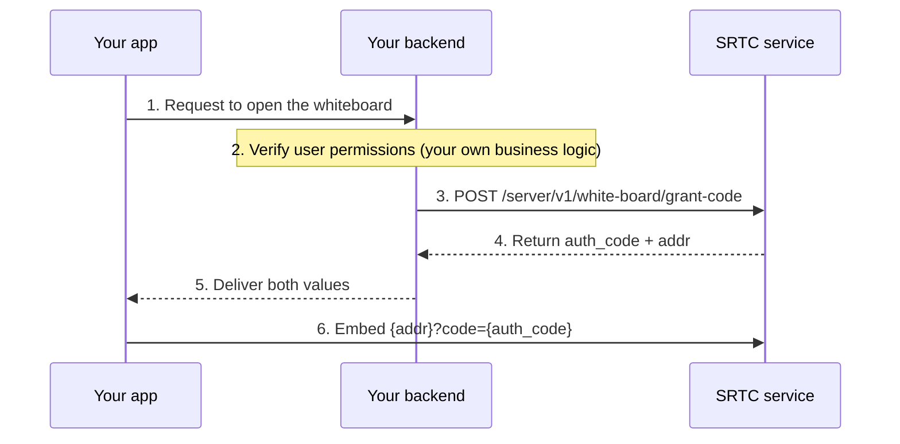
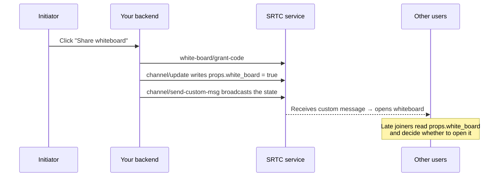

The SRTC whiteboard is an **H5 page hosted by the SRTC service**. Embed it in your own UI (an `iframe` on Web, a WebView on native platforms) and it's ready to use. Stroke sync goes through the whiteboard's own signaling channel, so it **doesn't use any of the channel's tracks** and doesn't affect audio or video.

So integrating the whiteboard really comes down to two things: **getting a page URL with an auth code**, and **deciding when to show it**.

---

## Boards and channels

A whiteboard is identified by `board` (the board ID), which has the same character set restrictions as channel names. **Everyone using the same `board` is on the same board**.

`board` isn't strictly bound to a channel; both usages work:

| Usage | `board` value | Use case |
| --- | --- | --- |
| Per-channel whiteboard (recommended) | The channel name | One whiteboard per call; everyone in the call naturally lands on the same board |
| Standalone whiteboard | A custom ID | The whiteboard isn't tied to any particular call, such as a courseware board or a long-lived project board |

<Warning>
The cost of using the channel name is that the board **disappears with the channel**: destroying a channel also destroys the whiteboard with the same name, and a channel is destroyed automatically after 2 hours with no one in it. If the content needs to be kept long term, `board` must not be the channel name. See [Lifecycle and destruction](#lifecycle-and-destruction) below.
</Warning>

A whiteboard is **created automatically the first time access is granted**; you don't need to create it in advance.

---

## Two ways to open it

<Note>
Both paths open the same page; the only difference is where the auth code comes from. Users in the channel only need path A and don't have to call the server API.
</Note>

### Path A: Users in the channel use it directly (recommended)

The join channel response **already includes a ready-made whiteboard URL**. The auth code is that user's `sid` for this session, and `board` is the channel name. Embed it as is—no extra calls.

How to get it on each platform:

| Platform | How to get it |
| --- | --- |
| Web / Mini Program | `srtc.getChannelInfo()?.white_board` |
| Android | The third parameter of the `onJoinSucceed(channel, uid, whiteBoard)` callback |
| Swift | `channel.channelInfo?.whiteBoard` (`channel` is the return value of `joinChannel()`) |
| Go | `channel.GetInfo().WhiteBoard` |

```typescript
// Web: embed the whiteboard in the page after joining the channel
await srtc.join(token);
const url = srtc.getChannelInfo()?.white_board;
if (url) {
  const iframe = document.createElement("iframe");
  iframe.src = url;
  iframe.style.cssText = "width:100%;height:100%;border:0";
  container.appendChild(iframe);
}
```

<Note>
The join channel responses of iOS (RTCEngineKit), Windows, and the C SDK don't expose this field; use path B on those platforms.
</Note>

### Path B: Your backend issues an auth code

Use this when **people who aren't in the channel also need the whiteboard**, or for a standalone whiteboard whose `board` differs from the channel name.



The `uid` / `name` in the request determine the collaborator cursor and author name shown on the whiteboard. For endpoint details, see [Server API · Whiteboard](/en/rtc/server-api/white-board).

<Warning>
**An auth code is valid for 1 hour and expires as soon as a connection succeeds.** Request a new one every time you open the whiteboard; don't cache it, and don't share one code among multiple people.
</Warning>

---

## URL parameters

You can append these query parameters to the page URL. The URL from path A already includes the first four:

| Parameter | Required | Description |
| --- | --- | --- |
| `code` | Yes | Auth code: the user's `sid` for path A, or the `auth_code` returned by `grant-code` for path B |
| `device_id` | No | Device ID |
| `device_type` | No | Device type: `1` Windows, `2` Android, `3` iOS, `4` Linux, `5` macOS, `6` WebRTC, `7` Mini Program; defaults to `0` unknown |
| `version` | No | Client version, used for troubleshooting |
| `no_menu=1` | No | Hides the main menu button in the top-left corner, so you can replace it with your own UI |
| `no_tool=1` | No | Hides the bottom toolbar |
| `readonly=1` | No | Read-only: can view but not draw (and can't create or delete pages); see [Permissions](#permissions-a-single-switch) below |
| `export_btn=1` | No | Shows the export image button (the result is returned through the host API; see below) |
| `overlay=1` | No | Desktop annotation mode; see below |

<Note>
`no_menu` / `no_tool` / `readonly` **only set the initial state when the page opens**. To change them during the call (for example, temporarily taking away someone's pen and giving it back later), call the corresponding `window` method in the [host APIs](#embedding-in-a-native-webview); changing the URL has no effect.
</Note>

### Overlay annotation mode

`overlay=1` makes the whiteboard **semi-transparent over the shared desktop video** for annotation. The canvas is fixed at 1920×1080 and zooming is disabled—all clients must share the same coordinate system so strokes land on the same spot of the desktop content. The host needs to call `window.setReceiverScreenSize(w, h)` to tell the whiteboard the local screen size.

Don't add this parameter for a regular interactive whiteboard: it hides the main menu and makes the background nearly fully transparent.

---

## Permissions: a single switch

Whether someone can draw is controlled in one place only:

```javascript
window.setReadonly(true)   // View only
window.setReadonly(false)  // Can draw
```

It's a capability switch in the whiteboard core—when on, drawing, creating pages, and deleting pages are blocked at the core level, and keyboard shortcuts and the context menu don't work either. You can call it at any time during the call without reloading the page (`readonly=1` in the URL is only the initial value).

<Warning>
**Don't use "hide the toolbar" as permission control.** `no_menu` / `no_tool` (and the corresponding `setShowMenu` / `setShowToolUi`) only hide UI elements; users can still draw with keyboard shortcuts (`D` pen, `E` eraser) and the context menu. Only `setReadonly` prevents actions.

Conversely, `setReadonly(true)` doesn't tidy up the UI for you either: the whiteboard keeps only the select / hand / laser pointer tools and collapses the style panel, but the main menu and page menu remain. Combine the two as needed.
</Warning>

---

## Multi-page whiteboards and page following

The whiteboard supports multiple pages, and **the page list syncs automatically across clients**—when anyone creates, deletes, or renames a page, everyone else sees it. If you use **移动到页面** (*Move to page*) in the context menu to move a shape to another page, others can see it on that page too.

The page-following rule is simple: **when someone who can draw turns the page, everyone else follows.**

| This person | When they turn the page | When someone else turns the page |
| --- | --- | --- |
| Can draw (default) | Everyone else follows | They follow too |
| Read-only (`readonly`) | Only they move; others aren't affected | They follow too |

There's no concept of host or roles—control over page turning follows who can draw, so you only need to manage `setReadonly`. People who join midway automatically align to the page everyone is currently on; you don't need to do anything extra.

When several people can draw at once, whoever turned the page last wins. This is intentional: a shared whiteboard should keep everyone on the same page. If you really want one client to browse freely without disturbing others, set it to `readonly`.

"Which page we're on" is session state and isn't persisted—a new call doesn't inherit the page the previous call stopped on. The pages themselves and their strokes stay on the board until the whiteboard is destroyed.

---

## Bringing the whole channel into the whiteboard

<Warning>
**SRTC doesn't automatically broadcast "someone opened the whiteboard".** The whiteboard only syncs strokes; "whether whiteboard sharing is currently on" is business state, and you need to broadcast it yourself.
</Warning>

Recommended approach (this is what the Web Demo does): **record the state in custom channel properties + notify with a custom message**. You need both—the message notifies the people already there, and the property lets people who join midway restore the current state.



The message body broadcast by your backend:

```json
{
  "channel": "fire",
  "action": "white_board",
  "content": { "status": 1 },
  "uid": "1001",
  "important": true
}
```

After receiving the custom message, the client toggles the whiteboard view based on `status`:

```typescript
// Web: register the channel event callback before join
srtc.onNotifyChannelEvent = async (evt: ChannelEvent) => {
  if (evt.type !== ChannelEventType.CUSTOM_MSG) return;
  const data = evt.data as CustomMsgData;
  if (data.action !== "white_board") return;

  const opened = data.content.status === 1;
  if (opened && data.uid !== myUid) {
    // Someone else opened the whiteboard; get the URL yourself too (with path B, request it from your backend)
    await openWhiteBoard();
  }
  isShareBoard.value = opened;
};
```

To close the whiteboard, do the reverse: call `white-board/destroy`, set `props.white_board` back to `false`, and broadcast `status: 0`.

<Note>
You define the value of `action`; `white_board` here is just the Demo's convention. For events and data structures, see [Events](/en/rtc/web/events); for the broadcast endpoint, see [Server API · Channel](/en/rtc/server-api/channel).
</Note>

---

## Embedding in a native WebView

The whiteboard page is a standard web app, and the WebView must **allow JavaScript**. Beyond that, there are two sets of host APIs:

**H5 calls the host** (you need to inject implementations in the WebView):

| API | When it fires |
| --- | --- |
| `window.AndroidInterface.onWbDestroy(reason)` | The whiteboard was destroyed (someone called destroy, or it was cleaned up on expiry); the host should close the whiteboard view |
| `window.AndroidInterface.onExportImage(dataUrl)` | The user clicked the export button (requires `export_btn=1`); returns a Data URL in the form `data:image/png;base64,...` |

**The host calls H5** (call via `evaluateJavascript` / `evaluateJavaScript`; available only after the page finishes loading):

| API | Description |
| --- | --- |
| `window.setShowMenu(show)` | Shows or hides the main menu button in the top-left corner (dynamic version of URL `no_menu=1`) |
| `window.setShowToolUi(show)` | Shows or hides the bottom toolbar (dynamic version of URL `no_tool=1`) |
| `window.setReadonly(readonly)` | **Permission switch**: whether the user can draw (including creating / deleting pages); also decides who controls page turning. See [Permissions](#permissions-a-single-switch) |
| `window.setCurrentTool(tool)` | Switches the tool: `select` / `hand` / `draw` / `eraser` / `arrow` / `text` / `geo` / `line` / `highlight` / `laser` |
| `window.setReceiverScreenSize(w, h)` | Overlay mode only: tells the whiteboard the local screen size |

```java
// Android: take away someone's pen during the call
webView.evaluateJavascript("window.setReadonly(true)", null);
```

```swift
// iOS: switch to view-only (still follows others' page turns)
webView.evaluateJavaScript("window.setReadonly(true)", completionHandler: nil)
```

<Note>
These methods are attached only after the page finishes loading (`onPageFinished` / `didFinish navigation`); calling them earlier gives `undefined`. We recommend calling `setReadonly` once in the load-finished callback to initialize according to the user's business role, then calling it again whenever permissions change—no page reload needed.
</Note>

<Note>
The name `AndroidInterface` is historical; iOS and Windows mount under the same name.
</Note>

Mini Programs don't have `iframe`, so use the `<web-view>` component to host the page. It fills the whole page, and the whiteboard domain must first be configured as a business domain in the Mini Program admin console.

For a full Android example (WebView configuration, JS Bridge implementation, and handling `onShowFileChooser` when inserting images), see [Android · Whiteboard integration](/en/rtc/android/advanced/whiteboard).

---

## Lifecycle and destruction

| When | Result |
| --- | --- |
| Someone is granted access for the first time | Created automatically; no need to create it in advance |
| `white-board/destroy` is called | Content is cleared immediately and can't be recovered; people on the board are disconnected |
| **The channel with the same name is destroyed** | The whiteboard is destroyed with it (including the automatic destruction of a channel after 2 hours with no one in it) |
| No writes for more than 25 hours | Cleaned up by a scheduled task |

Use `white-board/exist` to check whether a board still exists—for example, to decide whether to show an "Open whiteboard" entry, or to confirm a destroy took effect.

---

## FAQ

**It opens a blank page / says unauthorized**

Usually an auth code problem: expired (more than 1 hour old), already used (a code can only connect once), or shared by multiple clients. Get a new one every time you open the whiteboard.

**Two people are drawing on different boards**

Check that both use the same `board`. With path A, `board` always equals the channel name, so it can't go wrong; with path B, your backend passes it in, and it's easy to pass the wrong one in multi-channel scenarios.

**The whiteboard content is gone after the call ends**

`board` was the channel name, so destroying the channel also destroyed the board. To keep the content, use a standalone `board` and manage when to destroy it yourself.

**What image formats can the whiteboard insert?**

JPEG / PNG / GIF / WebP / SVG, **up to 3 MB each**; video isn't supported. SVG is vector, so it stays sharp when zoomed, and works better than bitmaps for icons and drawings. On native platforms, to let users pick images you also need to handle `onShowFileChooser` in the WebView (see [Android · Whiteboard integration](/en/rtc/android/advanced/whiteboard)); we recommend compressing images to under 1 MB before returning them.

**Can I stream the whiteboard to clients that can't embed a WebView?**

The whiteboard itself doesn't produce a media stream. If the other side can't host H5, capture the whiteboard on a client that can and publish it as a custom video track; see [Custom tracks](/en/rtc/web/advanced/custom-track).

---

## Related

+ [Server API · Whiteboard](/en/rtc/server-api/white-board)—the three endpoints for grant, existence check, and destroy
+ [Server API · Channel](/en/rtc/server-api/channel)—channel properties and custom message broadcasts
+ [Key concepts](/en/rtc/key-concepts)—channels, users, and tracks
