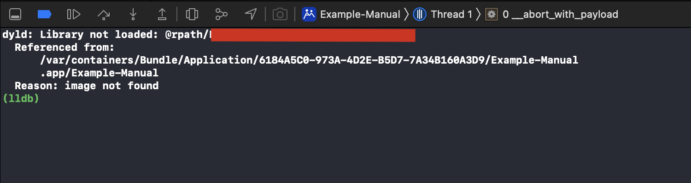

#### 集成组建后，Build失败问题
> 目前SDK最低版本支持 10.0 及以上 Xcode 10.0 以上。请确保配置达到要求。另外 Bitcode 编译需要改为NO。
>

#### 网络授权后网络请求失败可能原因
> <font style="color:#4D4D4D;">需要在 info.plist 中加入如下配置：</font>
>

```xml
<key>NSAppTransportSecurity</key>
<dict>
	<key>NSAllowsArbitraryLoads</key>
	<true/>
</dict>
```

#### 集成SDK打包上传苹果商店失败问题。
> 目前SDK只支持 arm64，请检查本地的工程配置，是否还有其他的支持，有的话请移除。
>

#### 手动集成时出现启动异常崩溃：<font style="color:#F5222D;">dyld: Library not loaded: @rpath/xxxxx.framework/xxxxx</font>
> <font style="color:rgb(51, 51, 51);">解决方案：</font><font style="color:rgb(0, 0, 0);">需要在 General->Framworks，Libraries,and Embedded Content 中添加依赖关系，并将对应动态库Embed设置为Embed&Sign</font>
>




