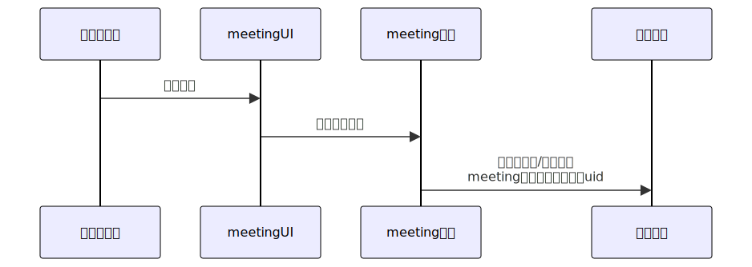
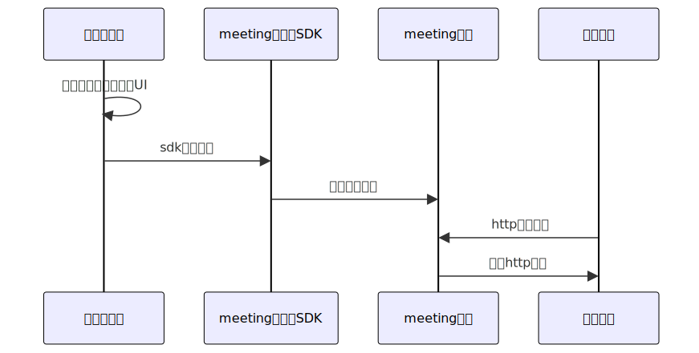

# 1、概述
本开发对接文档旨在指导开发者与meeting视频会议系统进行快速便捷的集成。

meeting没有自己的用户(`User`)体系，所有用户信息都需要由业务方来自定义。

meeting客户端提供带UI源码(极简对接)、不带UI SDK(自定义对接)两种对接方式。

meeting服务端提供http接口供业务后端主动调用，同时支持http事件回调业务后端。

# 2、对接流程
## 带UI极简对接
业务系统客户端直接源码引入meeting ui，无需关注会议业务逻辑。

业务系统服务端和meeting后端做好账号打通，其余均由meeting后端系统完成。

## 自定义对接
业务系统客户端自己实现ui，调用meeting客户端SDK提供的接口，来实现客户端功能。

业务系统服务端调用meeting后端api，同时提供回调api供meeting后端调用，来实现自定义复杂功能。

