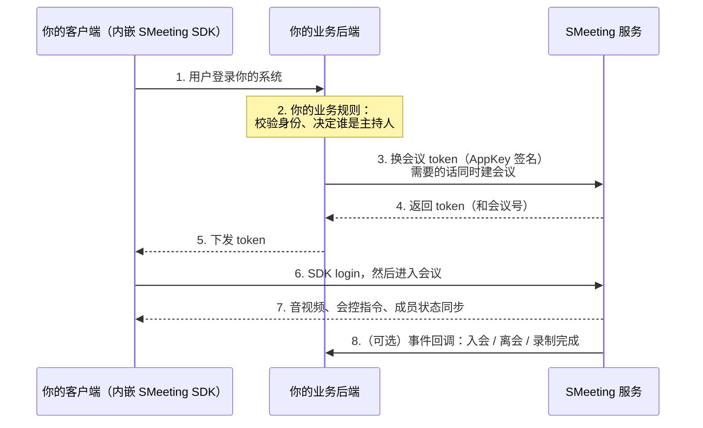

本页给出接入 SMeeting 的最短路径。先看清分工，再挑一种对接方式往下走。

---

## 谁负责什么

一次接入涉及四个角色：**两个是你的，两个是我们的**。

| 角色 | 谁做 | 负责什么 |
| --- | --- | --- |
| **你的客户端** | 你 | 会议界面与交互：入口按钮、画面布局、成员列表、会控按钮。音视频与会控能力靠内嵌我们的 SDK 获得 |
| **你的业务后端** | 你 | 用户体系与业务规则：谁是合法用户、什么时候建会、谁是主持人。用 `AppKey` 调我们的服务端 API |
| **我们的 SDK** | 我们 | 采集、编解码、传输、信令、会议状态同步、事件回调。它是一个库，跑在你的客户端里 |
| **我们的服务端** | 我们 | 媒体转发、会议与会控状态、录制 / 直播，以及给你的后端调用的服务端 API 与事件回调 |

一句话记住这条边界：**我们不碰你的用户体系，你不碰媒体流。**

+ SMeeting 没有自己的用户体系 —— `user_id` 直接用你业务系统里现成的用户 ID，同一个用户多端同时进会由我们自动区分
+ 音视频数据不经过你的服务器 —— 客户端直连我们的媒体服务，你的带宽账单不会因为开会而涨
+ 主持人、举手、静音全场、等候室这些会控规则我们已经实现好，不用你再写一遍


```mermaid
sequenceDiagram
    participant FE as 你的客户端（内嵌 SMeeting SDK）
    participant BE as 你的业务后端
    participant SM as SMeeting 服务

    FE->>BE: 1. 用户登录你的系统
    Note over BE: 2. 你的业务规则：<br/>校验身份、决定谁是主持人
    BE->>SM: 3. 换会议 token（AppKey 签名）<br/>需要的话同时建会议
    SM-->>BE: 4. 返回 token（和会议号）
    BE-->>FE: 5. 下发 token
    FE->>SM: 6. SDK login，然后进入会议
    SM-->>FE: 7. 音视频、会控指令、成员状态同步
    SM->>BE: 8.（可选）事件回调：入会 / 离会 / 录制完成
```

整条链路里，**你的后端负责「换钥匙」，你的客户端负责「用钥匙」**，媒体走我们，业务判断走你。

---

## 三种对接方式

上面那张图画的是投入最大、也最自由的第三种。实际上界面这一格可以交给我们，投入从小到大：

| 方式 | 你要做的 | 界面 | 适合 |
| --- | --- | --- | --- |
| **服务端极简对接** | 后端对三个接口，拼一个 URL | 我们部署好的 | 把会议挂到既有业务流程上（评审、工单、招投标） |
| **带 UI 极简对接** | 拿走前端源码，自己改、自己部署 | 我们的源码，你可改 | 要自己的品牌和少量定制 |
| **自定义对接** | 集成各端 SDK，自己写界面 | 完全自己做 | 做会议产品，交互要深度定制 |

### 服务端极简对接

**不集成 SDK、不写会议界面。** 会议客户端、用户体系、登录态都由我们部署，你的后端只做三件事：

```text
业务活动创建时
  └─ POST /server/v1/meet/create          挂上你的业务单据号 → 拿到 room_no

用户点「进入会议」
  ├─ POST /stm/srvapi/v1/member/grant     account + 昵称 → token（人不存在就现场建）
  └─ 302 跳转 /stm/ui/outer?token=&room_no=
```

详见 [服务端极简对接](/zh/meeting/ui-sdk/server-integration)。

### 带 UI 极简对接

会议界面用我们的前端源码，你自己改样式、自己部署；账号打通仍由你的后端和我们对接，会议逻辑不用碰。见 [带 UI 极简对接](/zh/meeting/ui-sdk/web)。

### 自定义对接

集成各端 SDK 自己写界面，会控、录制、成员管理按需调用。就是上面时序图画的那条路，下面的平台入口即从这里开始。

---

## 接入前

<Steps>
<Step title="申请应用">
拿到 **AppID** 和 **AppKey**。AppKey 是服务端密钥，绝不能放进客户端 —— 详见 [Token 与鉴权](/zh/meeting/token)。
</Step>

<Step title="选定对接方式">
先看上面那张表。要的只是「给这场评审加一个会议入口」，服务端极简对接当天就能跑通；要做会议产品再走自定义对接。三者的详细取舍见 [概览](/zh/meeting/overview#三种对接方式)。
</Step>

<Step title="打通 Token 签发">
时序图第 3 步，是自定义对接里**唯一必须写的服务端代码**：校验完你自己的用户身份后，用 AppKey 签名调授权接口，把 token 返给客户端。之后各端 SDK 的流程都是 `login(token)` → 创建 / 查询会议 → 进入会议。
</Step>
</Steps>

---

## 选择你的平台

| 平台 | 入口 |
| --- | --- |
| Web | [集成](/zh/meeting/web/integration) · [快速开始](/zh/meeting/web/quickstart) |
| Android | [集成](/zh/meeting/android/integration) · [快速开始](/zh/meeting/android/quickstart) |
| Windows | [集成](/zh/meeting/windows/integration) · [快速开始](/zh/meeting/windows/quickstart) |
| Swift（iOS / macOS） | [集成](/zh/meeting/swift/integration) · [快速开始](/zh/meeting/swift/quickstart) |
| iOS（Objective-C） | [快速开始](/zh/meeting/ios/quickstart) |
| 服务端 | [服务端 API](/zh/meeting/server-api/overview) |

---

## 几个最常问的边界问题

**音视频要经过我的服务器吗？** 不需要。客户端直连我们的媒体服务，你的后端只参与鉴权和业务判断。

**用户要先在你们那边注册吗？** 不需要。`user_id` 用你自己的用户 ID 即可，我们不存你的用户资料。

**AppKey 放前端会怎样？** 拿到它的人可以把任意用户授权进任意会议、踢人、结束会议。它只能待在服务端。

**会中角色能自己定义吗？** 默认是内置的三档（普通成员 / 主持人 / 联席主持人）。业务身份差异大的场景另有一套自定义角色的路子，见 [核心概念 · 自定义角色](/zh/meeting/key-concepts#自定义角色)。

**后端怎么知道会议里发生了什么？** 注册回调即可，不用轮询。见 [回调事件接入指南](/zh/meeting/server-api/guides/callbacks)。
