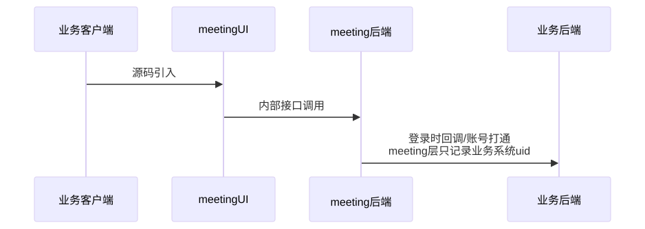
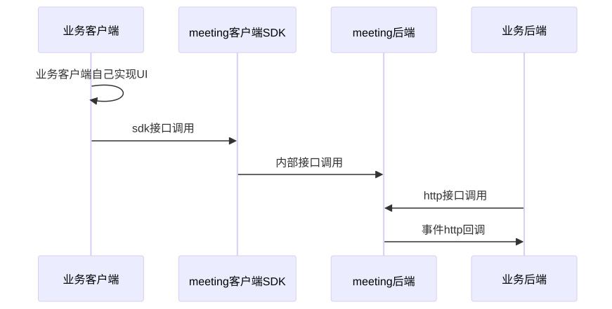

## 1、概述
本开发对接文档旨在指导开发者与meeting视频会议系统进行快速便捷的集成。

meeting没有自己的用户(`User`)体系，所有用户信息都需要由业务方来自定义。

meeting 提供三种对接方式：**服务端极简对接**（不集成 SDK、不写界面，后端拼 URL 拉起我们部署好的会议页）、**带 UI 极简对接**（引入我们的前端源码自己部署）、**自定义对接**（集成 SDK 自己写界面）。三者的差异与选择见 [概览](/zh/meeting/overview#三种对接方式)。

meeting服务端提供http接口供业务后端主动调用，同时支持http事件回调业务后端。

## 2、对接流程
## 带UI极简对接
业务系统客户端直接源码引入meeting ui，无需关注会议业务逻辑。

业务系统服务端和meeting后端做好账号打通，其余均由meeting后端系统完成。

## 自定义对接
业务系统客户端自己实现ui，调用meeting客户端SDK提供的接口，来实现客户端功能。

业务系统服务端调用meeting后端api，同时提供回调api供meeting后端调用，来实现自定义复杂功能。

