视频会议 SDK 提供了上层 UI 开源套件，目前 iOS 平台仅支持 Objective-C 语言，通过简单 API 调用即可唤起会议 UI。

> 说明：如果您有自己的 UI 设计，想结合会议业务自行开发，我们同时提供有灵活性更好，功能更全面的 MeetingKit SDK，您可以通过查看我们的 [MeetingKit API](https://www.yuque.com/anyconf/eanoso/fb2vg0nhmwue9kvd) 文档，了解更多功能。
>

## 功能概述
组件提供预约会议、音视频控制、屏幕共享、会议录制、成员管理、会控管理、会中聊天等丰富的功能交互，支持多种业务场景。

| **功能列表** | **功能描述** |
| --- | --- |
| 多人音视频 | 支持大规模人员参会，并支持多人同时开启音视频。 |
| 标准会议 UI | 含有标准会议所需要的UI组件，可满足基本音视频会议场景所需功能。 |
| 自定义 UI | 由于为开源套件，您也可根据自身业务场景自定义UI。 |
| 预约会议 | 支持预约会议、并将预约会议显示在会议列表。 |
| 屏幕分享 | 支持屏幕共享，让会中成员同时观看共享屏幕中所展示的内容。 |
| 会议控制 | 会控分为会前控制和会中控制：<br/>+ 会前创建并加入会议时，可以通过预先设定会议的相关参数调整麦克风、摄像头、扬声器的打开情况，并决定会议的模式、类型以及参会方式(密码、仅限受邀等)。<br/>+ 会中可以对所有成员进行管控，全体静音/禁视频、修改名称、移出房间、转交主持人、邀请开麦/关麦、锁定等。 |
| 会中聊天 | 参会成员可以实时在聊天区发送消息，主持人或管理员也可以设置禁止参会者在会中发送消息。 |
| 云端录制 | 支持用户在视频会议场景中进行录制以及画面合成等功能。 |
| 多端登录会议 | 支持多设备设备登录。 |
| 举手发言 | 当会议设置了全体静音时，会议成员可以向管理员发出发言请求。 |
| 房间密码 | 支持创建密码房间、预约密码房间。 |
| 设置昵称、头像 | 支持在会议过程中修改用户参会昵称。 |


## 快速跑通
### 环境准备
+ iOS 12.0 及以上版本

### 下载示例
#### 1、下载源码
+ 方式一：从 github 下载 [MeetingKit Demo](https://github.com/seastart/meeting-iOS-demo) 源码。
+ 方式二：直接在命令行运行以下命令：

```objectivec
 git clone https://github.com/seastart/meeting-iOS-demo.git
```

#### 2、添加依赖库
```objectivec
pod 'MeetingKit', :git => "https://github.com/seastart/meeting-ios-cocoapods.git"
```

#### 3、安装依赖库
```objectivec
pod install
```

### 跑通示例
#### 1、生成您自己的证书
##### 1.1、点击 Xcode 并找到 Edit Behaviors。
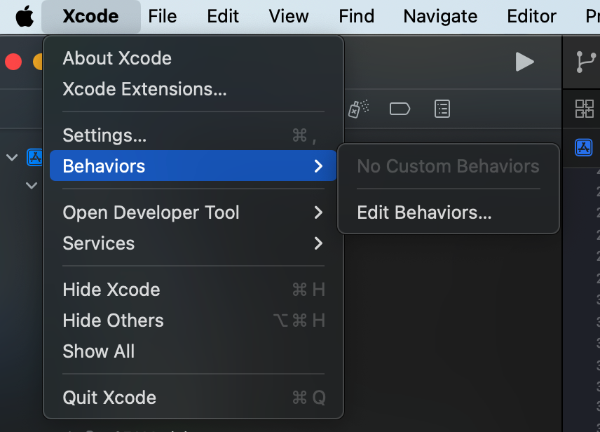

##### 1.2、单击 Account 选项卡，然后单击左下角的 + 号，选择添加 Apple ID 并单击 Continue。
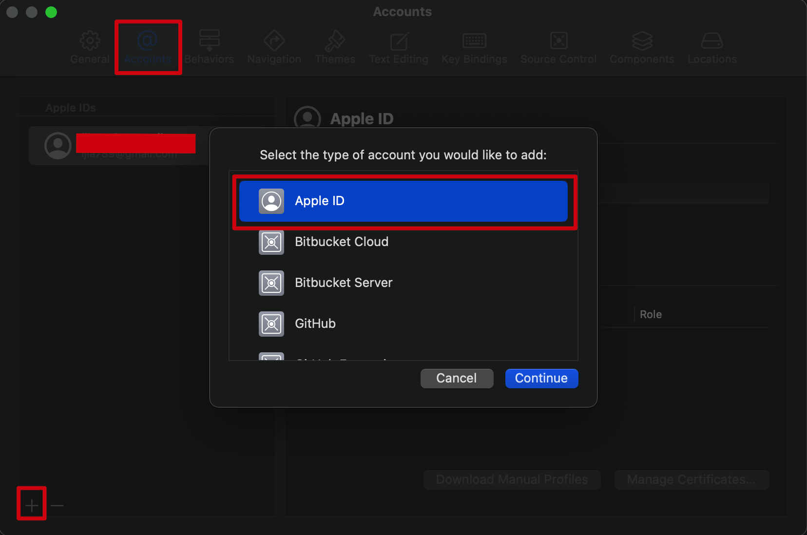

##### 1.3、输入您的 Apple ID 和密码进行登录。
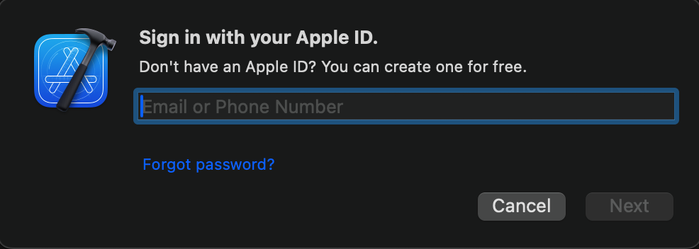

#### 2、点击进入项目 TARGETS 下的 Signing & Capabilities 选项卡，在 Team 中选择自己的开发者证书
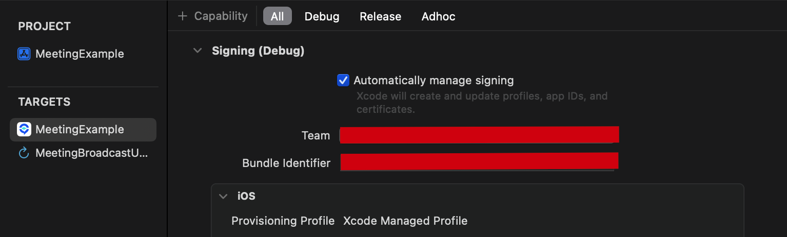

#### 3、运行项目
##### 3.1、请先打开 iOS 设备的开发者模式，通过点击设置 > 隐私与安全性 > 开发者模式进行开启。将设备连接上电脑，并在 XCode 上选择运行 Demo 的设备。
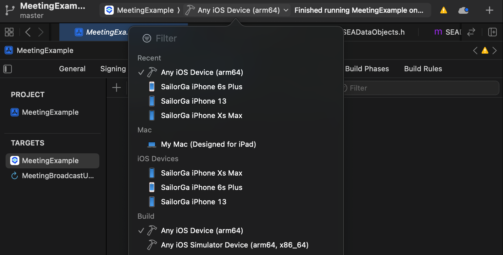

##### 3.2、单击运行，即可将我们的 MeetingKit iOS Demo 运行到目标设备上。
| **登录界面****** | **主界面** | **创建会议界面** |
| --- | --- | --- |
| 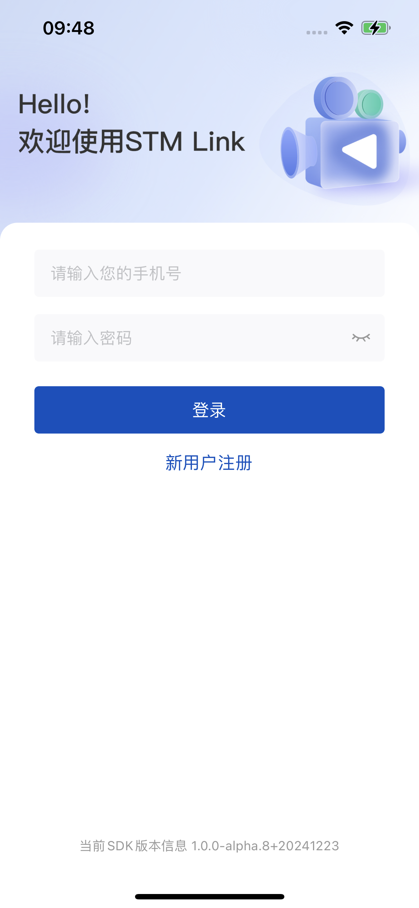 | 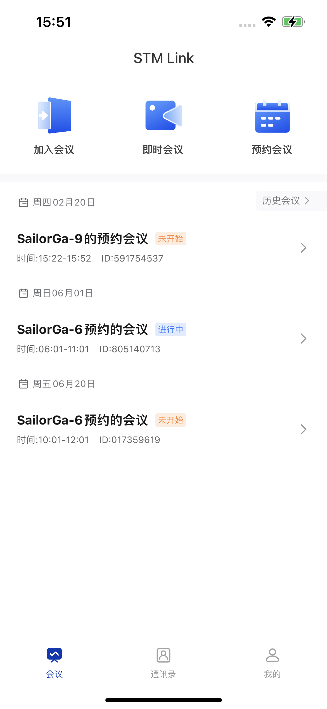 | 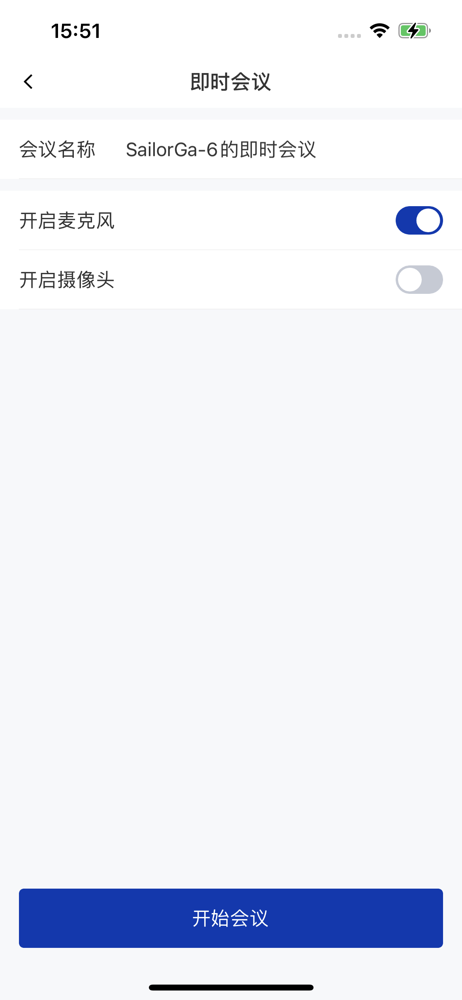 |


### 主持人发起会议
会议主界面为 FWRoomViewController，您只需要在调用 MeetingKit 接口创建房间成功后，按照如下示例创建并跳转 FWRoomViewController 即可发起快速会议。

#### 创建房间
##### 构建会议参数
会议参数由很多的字段构成，但通常您只需要关注特定几个字段，详情可参看 [SEAMeetingParam](https://www.yuque.com/anyconf/eanoso/gkeau9oyh5vms80z#gQ8nA)。

```objectivec
SEAMeetingParam *meetingParam = [[SEAMeetingParam alloc] init];
meetingParam.title = @"Meeting Title";
```

##### 创建房间
```objectivec
[[MeetingKit sharedInstance] createRoom:meetingParam onSuccess:^(id _Nullable data) {
    NSString *roomNo = (NSString *)data;
    NSLog(@"创建房间成功，生成的房间号码为：%@", roomNo);
} onFailed:^(SEAError code, NSString * _Nonnull message) {
    NSLog(@"创建房间失败，code = %ld, message = %@", code, message);
}];
```

#### 加入房间
##### 构建入会参数
```objectivec
/// 创建入会对象
FWMeetingEnterModel *enterModel = [[FWMeetingEnterModel alloc] init];
enterModel.roomNo = @"Your Room No";
enterModel.nickname = @"Your Nickname";
enterModel.audioState = YES;
enterModel.videoState = NO;
enterModel.avatar = @"Your Avatar";
```

##### 跳转会议主界面 
```objectivec
/// 加入会议主界面
[self push:@"FWRoomViewController" info:enterModel block:nil];
```

| **<font style="color:rgb(46, 48, 51);background-color:rgb(245, 247, 250);">会中界面</font>** | **<font style="color:rgb(46, 48, 51);background-color:rgb(245, 247, 250);">会控界面</font>** |
| --- | --- |
| 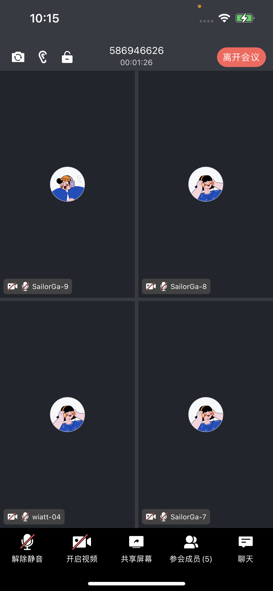 | 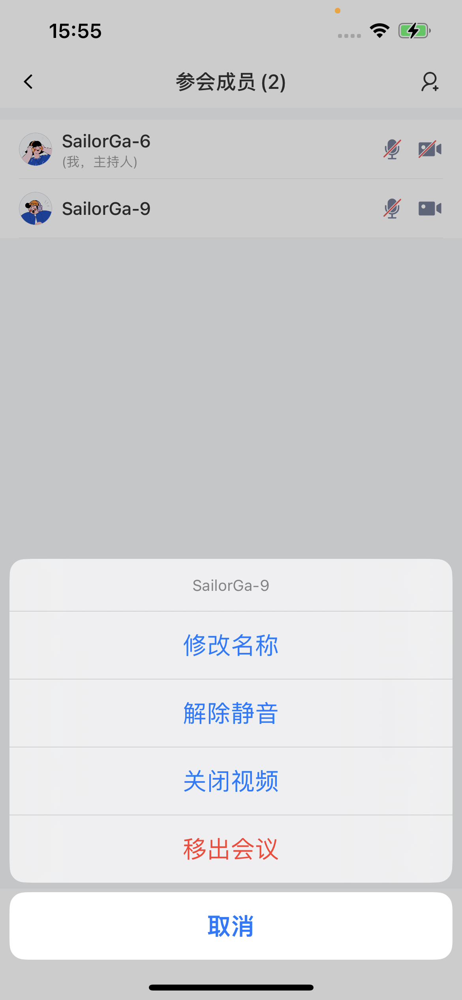 |


### 普通成员加入会议
按照上述**加入房间**示例创建并跳转会议主页面，即可加入一场会议。

| **<font style="color:rgb(46, 48, 51);background-color:rgb(245, 247, 250);">加入会议界面</font>** | **<font style="color:rgb(46, 48, 51);background-color:rgb(245, 247, 250);">会中界面</font>** |
| --- | --- |
| 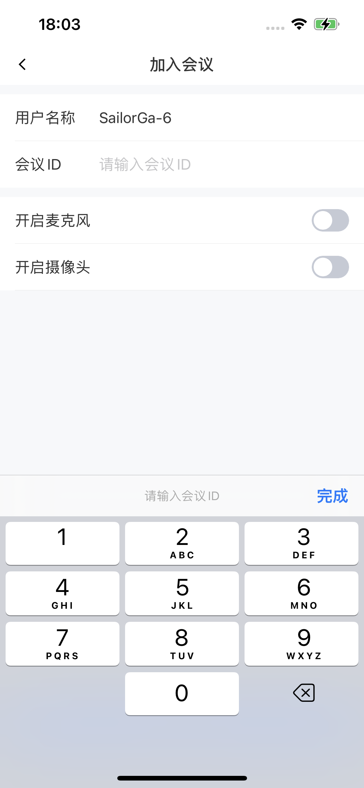 | 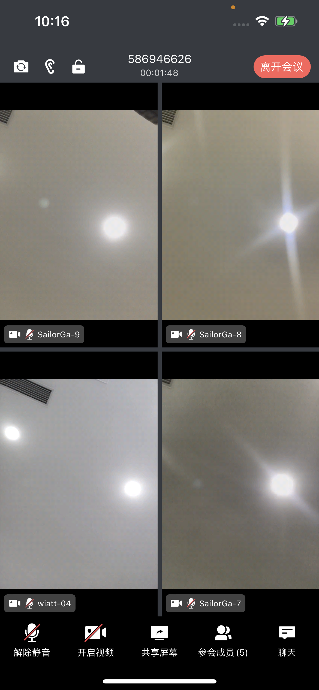 |


## 预约会议
### 使用说明
支持预约房间，用户可以预约一个房间并安排日程中的会议。当会议时间到来时，用户只需一键即可开启会议沟通。

| **预约会议** | **会议列表** |
| --- | --- |
| 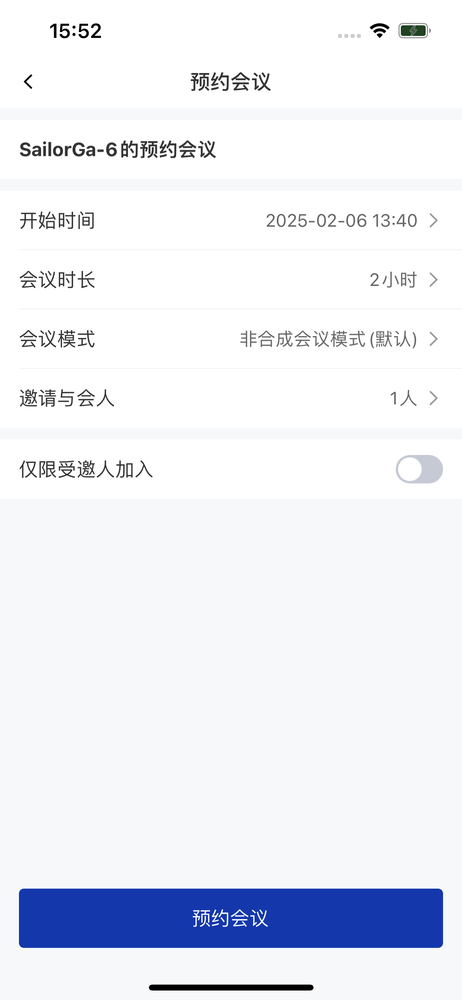 |  |


| **设置会议** | **邀请成员** |
| --- | --- |
| 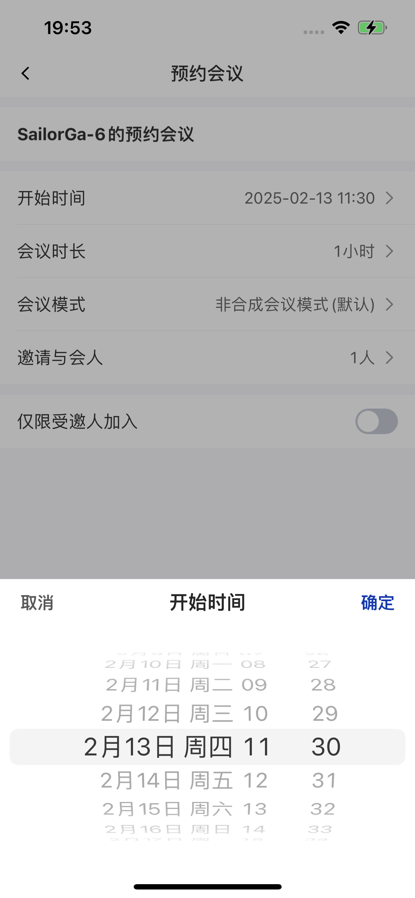 | 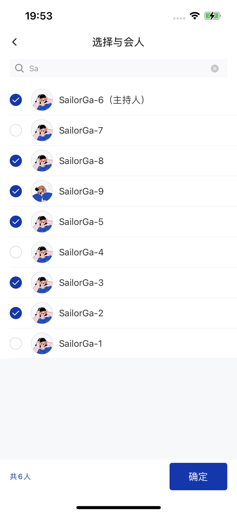 |


### 功能接入
#### 如何预约房间
使用预约房间功能时，您需要拉起示例中提供的预定房间页面：

```objectivec
/// 创建会议详情
FWMeetingDetailsModel *detailsModel = [[FWMeetingDetailsModel alloc] init];
/// 设置当前不在房间内
detailsModel.isRoom = NO;
/// 设置当前成员为管理员
detailsModel.isMeetingAdmin = YES;
/// 设置会议当前未结束
detailsModel.isMeetingFinish = NO;
/// 设置受邀人员列表数据
detailsModel.memberLists = [self.viewModel.memberLists mutableCopy];
/// 跳转预约会议页面
[self push:@"FWMeetingScheduleViewController" info:detailsModel tag:FWMeetingScheduleStateCreate block:nil];
```

+ 预约会议可设置的属性：其中可设置内容包含：会议名称、会议类型、开始时间、会议时长、会议模式、邀请成员、会议加密、成员管理等。
+ 如何邀请成员：点击 "邀请与会人"->"添加" 即可邀请成员。

| **邀请与会人** | **与会人列表** | **选择与会人** |
| --- | --- | --- |
| 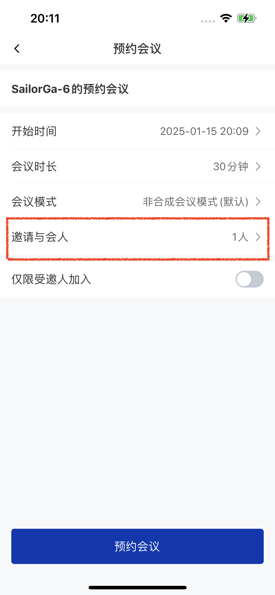 | 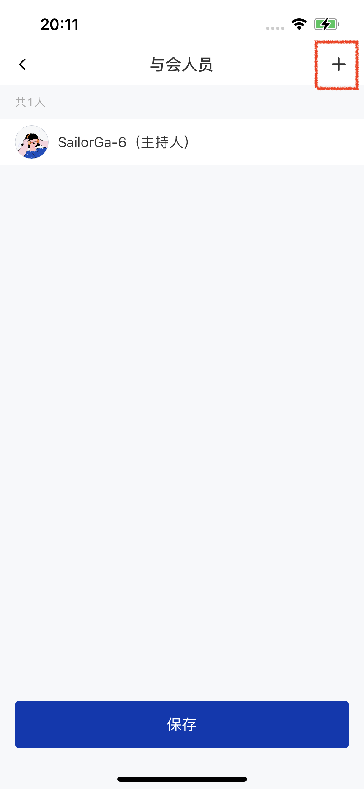 | 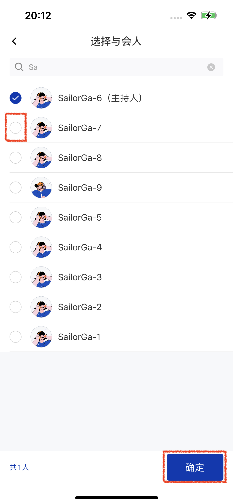 |


#### 查看已预约的房间
示例中提供了房间列表的UI视图 FWHomeViewController，会议列表提供以下功能：

+ 查看会议列表：列表中包括您创建的会议以及您被邀请参加的会议。
+ 查看会议详情：您可以点击某个会议查看该会议的详情。
+ 修改会议信息：点击会议列表某个会议，若该会议未进行，且您是发起人，您可以修改该会议信息。

| **会议列表** | **查看会议详情** | **修改会议信息** |
| --- | --- | --- |
| 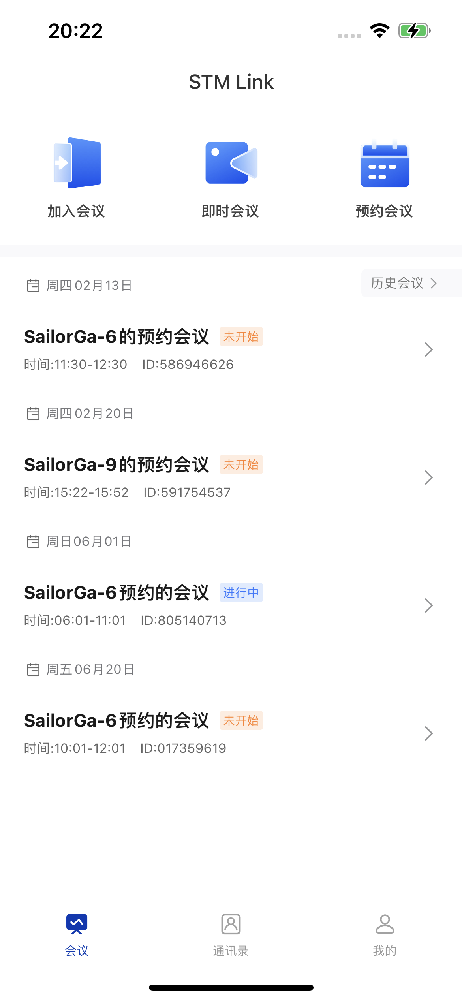 | 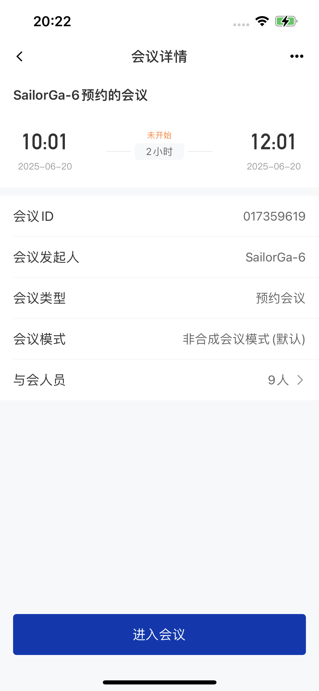 | 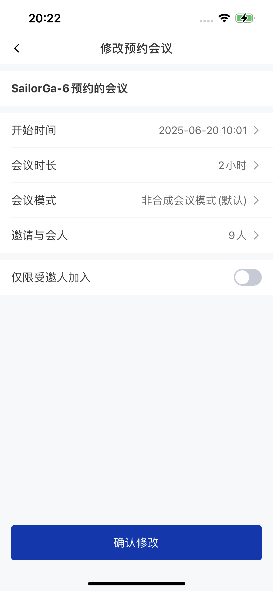 |


##   
会议控制
### 使用说明
用户创建并进入房间后，创建者或管理员角色通过点击底部工具栏成员按钮，在底部弹出的成员列表中既可以选中任一普通成员进行请求开始视频/音频、设置管理员、禁言、踢出房间等会控操作，也可以对房间内所有成员进行全体静音等会控操作。

| **会中界面** | **成员管理** | **全体静音/禁画** |
| --- | --- | --- |
| 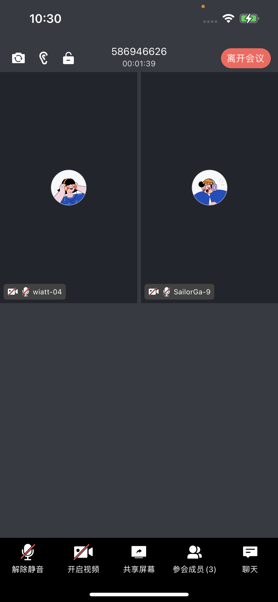 | 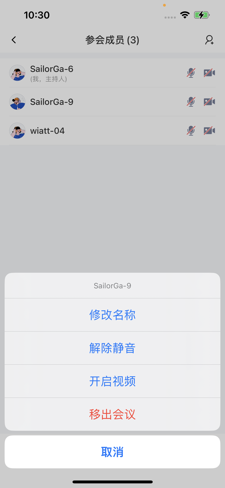 | 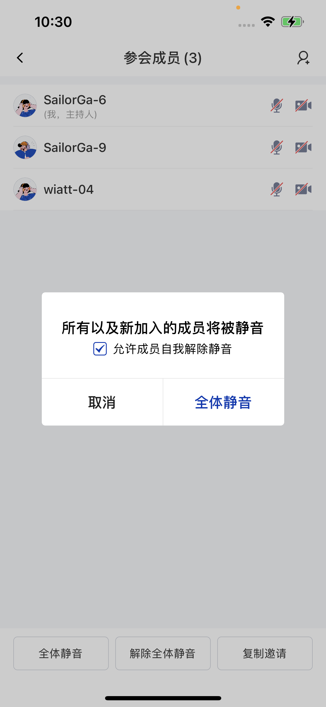 |


| **会前控制** | |
| --- | --- |
| 创建房间 | 您可以配置房间：开启麦克风/摄像头、全体静音、全体禁画、房间密码、会议名称、会议类型、参会方式等。 |
| 进入房间 | 您可以配置房间：开启麦克风/摄像头。 |
| **会中控制** | |
| 您是创建者或管理员 | 您可以控制房间：全体静音/禁画、邀请成员、设置管理员及其转移、将成员踢出房间、开启或关闭成员的摄像头/麦克风等。 |


#### 会前控制
在创建和加入会议时，您需要预先设定会议的相关参数，通过`MeetingKit`会前控制的相关功能。

| **创建会议** | **加入会议** |
| --- | --- |
| 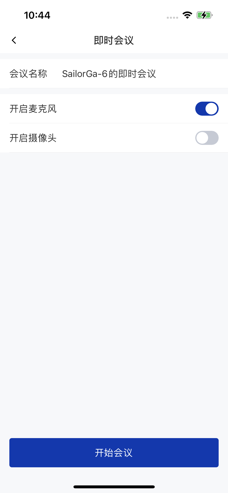 | 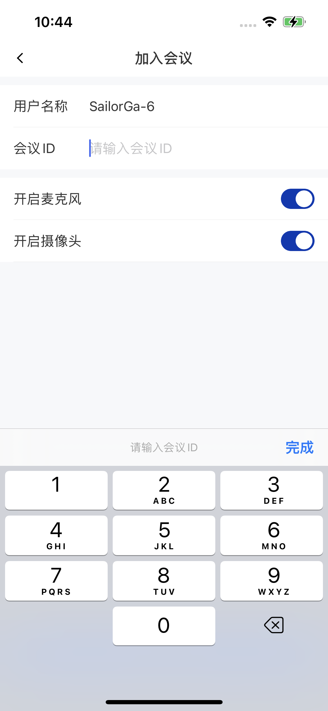 |


+ 您可以通过以下方式创建房间，完成会前控制：

```objectivec
/// 构建会议参数
SEAMeetingParam *meetingParam = [[SEAMeetingParam alloc] init];
/// 请替换您自定义的会议号，不设置系统会自动进行分配
meetingParam.roomNo = @"Your room no";
/// 会议标题
meetingParam.title = @"Your title";
/// 参会密码，请替换您自定义的会议密码
meetingParam.password = @"Your password";
/// 会议类型
meetingParam.meetingType = SEAMeetingTypeInitiate;
/// 会议模式
meetingParam.meetingMode = SEAMeetingModeNormal;
/// 入会静音状态
meetingParam.entryMutePolicy = SEAMeetingMuteState3;
/// 受邀成员，请替换您想要邀请的成员标识
meetingParam.conferee = @[@"target id"];
/// 创建房间
[[MeetingKit sharedInstance] createRoom:meetingParam onSuccess:nil onFailed:nil];
```

+ 您可以通过以下方式加入房间，并设置进房参数，完成会前控制：

```objectivec
/// 创建加入房间对象
FWMeetingEnterModel *enterModel = [[FWMeetingEnterModel alloc] init];
enterModel.roomNo = @"Your room no";
enterModel.nickname = @"User name";
enterModel.audioState = YES;
enterModel.videoState = YES;
enterModel.avatar = @"User avatar";
/// 进入房间界面
[self push:@"FWRoomViewController" info:enterModel block:nil];
```

#### 会中控制
房间创建者或管理员可以在"参会成员"->"成员列表"中管理会中所有成员。

+ 创建者或管理员可以选中任一成员进行单独管控：对其解除静音/静音、开启视频/关闭视频、禁言/解除禁言、修改名称、踢出房间等操作。

| **成员管理** | **修改名称** | **踢出会议** |
| --- | --- | --- |
| 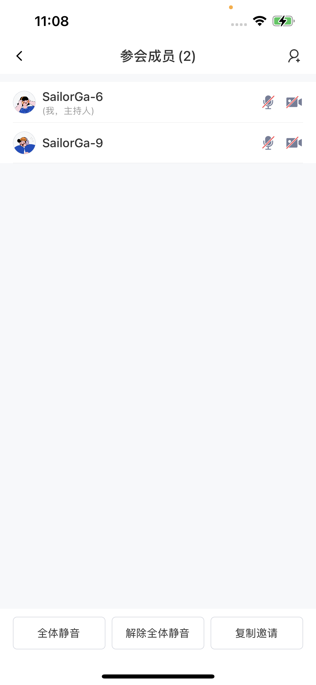 | 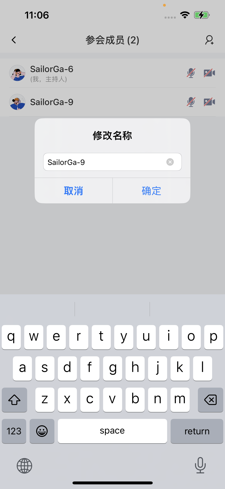 | 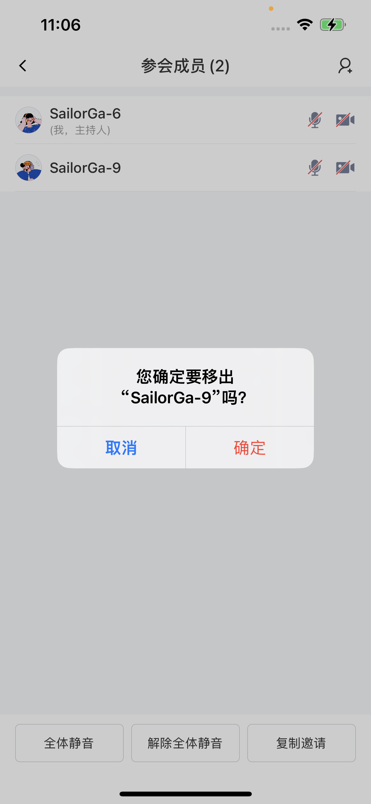 |


+ 创建者或管理员可以对房间内所有成员进行全体管控：全体静音/解除全体静音 、 全体禁画/解除全体禁画、邀请参会成员等。

| **全体静音** | **解除全体静音** | **邀请参会成员** |
| --- | --- | --- |
| 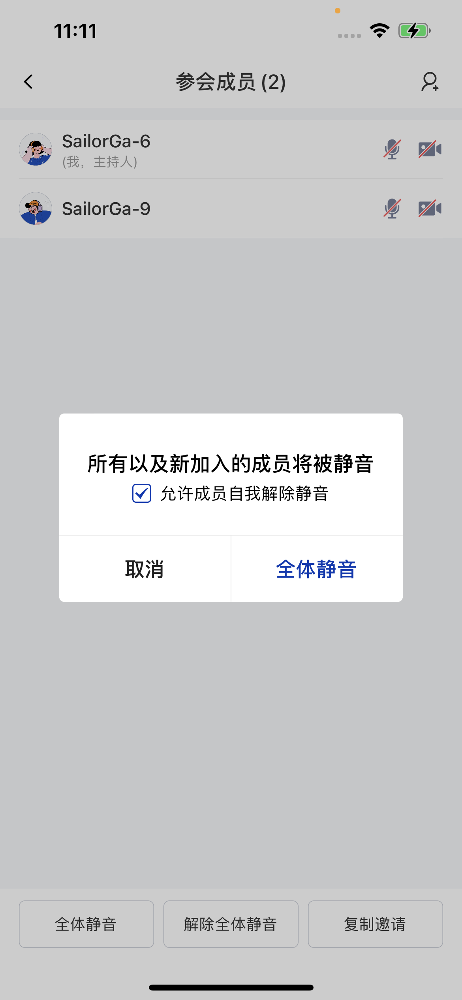 | 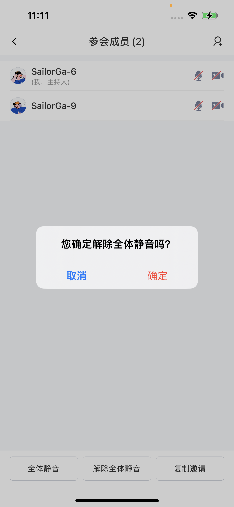 | 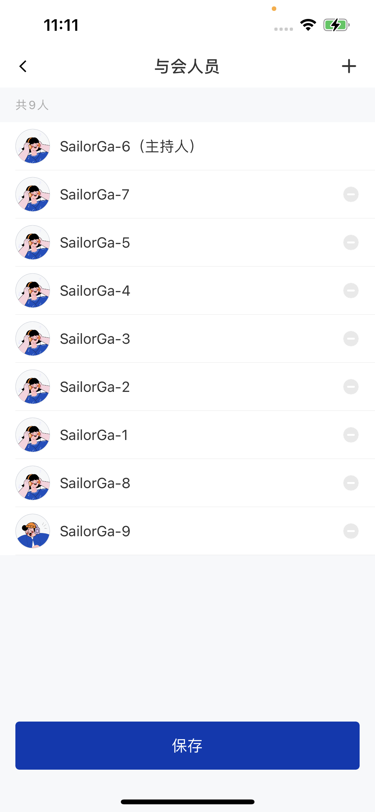 |


## 共享屏幕
### 使用说明
用户进入房间后，通过点击底部工具栏共享按钮，可以实现屏幕共享操作。

| **<font style="color:rgb(46, 48, 51);background-color:rgb(245, 247, 250);">屏幕共享</font>** | **<font style="color:rgb(46, 48, 51);background-color:rgb(245, 247, 250);">唤醒屏幕采集</font>** |
| :---: | :---: |
| 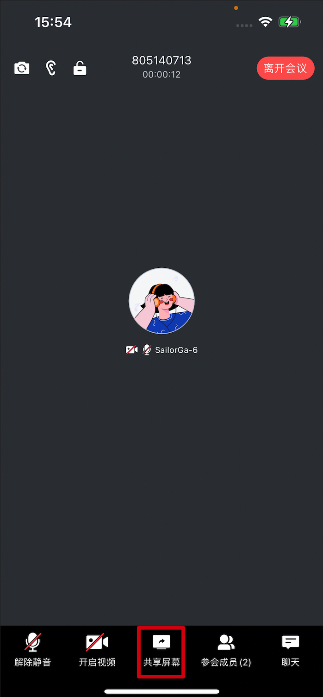 | 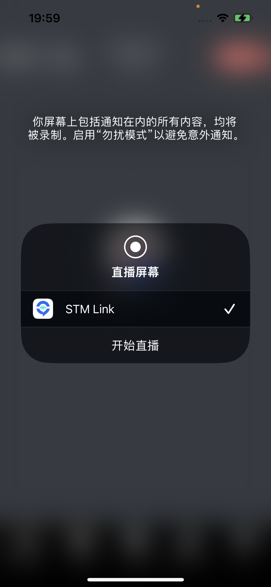 |


### 功能接入
iOS 系统上的跨应用屏幕分享，需满足系统在 iOS12 以上，需要增加 **Broadcast Upload Extension** 录屏进程以配合宿主 App 进程进行推流。Extension 录屏进程由系统在需要录屏的时候创建，并负责接收系统采集到屏幕图像。因此需要：

1. 创建 **App Group**，并在 Xcode 中进行配置(必选)。这一步的目的是让 Extension 录屏进程可以同宿主 App 进程进行跨进程通信；
2. 在工程中，新建一个 **Broadcast Upload Extension** 的 Target，并在其中集成 SDK 中专门为扩展模块定制的 `**MeetingKit.framework**`；
3. 对接宿主 App 端的接收逻辑，让宿主 App 等待来自 **Broadcast Upload Extension** 的录屏数据。

#### 1、创建 App Group
使用开发者帐号登录 [https://developer.apple.com/](https://developer.apple.com/) ，进行以下操作，注意完成后需要重新下载对应的**Provisioning Profile**文件。

1. 单击 **Identifiers**
2. 在右侧的界面中单击加号
3. 选择 **App Groups**，单击 **Continue**
4. 在弹出的表单中填写 **Description** 和 **Identifier**, 其中 **Identifier** 需要传入接口中的对应的 **AppGroup** 参数，完成后单击 **Continue**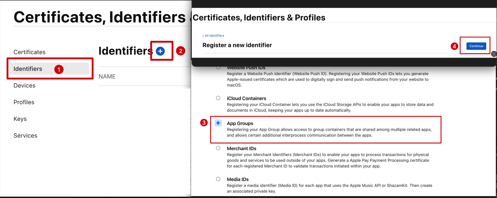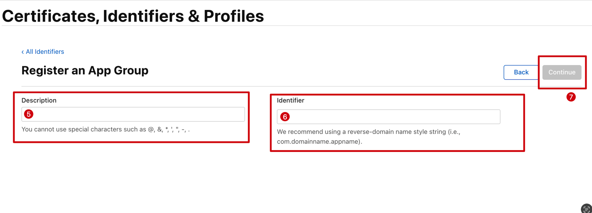
5. 回到 **Identifier** 页面，右上边的菜单中选择 **App IDs**，然后单击您的 **App ID**（宿主 **App** 与 **Extension** 的 **AppID** 需要进行同样的配置）
6. 选中 **App Groups **并单击 **Edit**
7. 在弹出的表单中选择您之前创建的 **App Group**，单击 **Continue** 返回编辑页，单击 **Save** 保存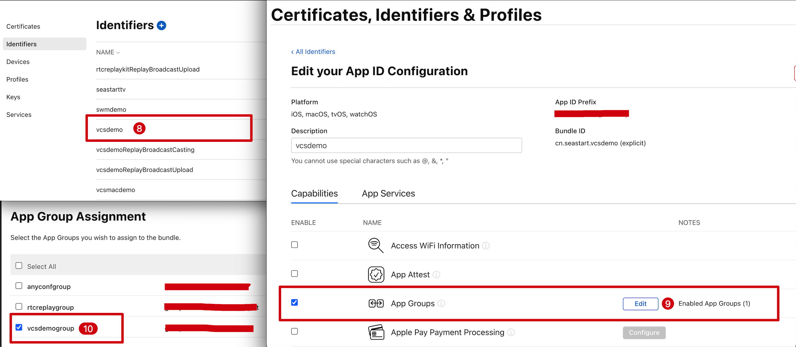
8. 重新下载 **Provisioning Profile** 文件，并配置到 **Xcode** 中

#### 2、创建 Broadcast Upload Extension
<font style="color:#333333;">在现有工程选择【New】->【Target…】，选择【Broadcast Upload Extension】，如图所示：</font>

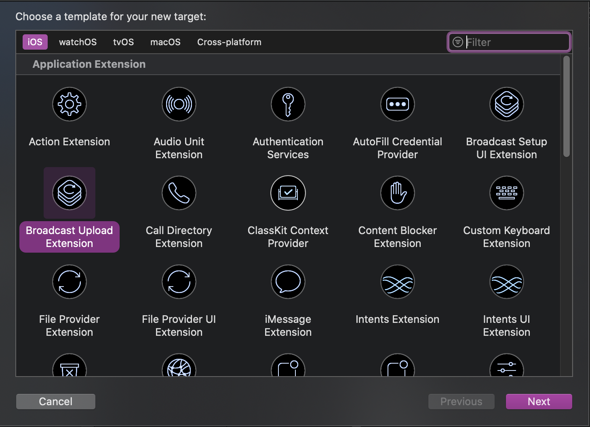

<font style="color:#333333;">配置好 Product Name。单击【Finish】后可以看到，工程多了所输 Product Name 的目录，目录下有个系统自动生成的 SampleHandler类，这个类负责录屏的相关处理。</font>

#### 3、为扩展添加SDK依赖
1. 手动集成方式需要将`**MeetingKit.framework**`导入上述<font style="color:#333333;">Product Name 的工程目录，并配置</font>依赖的系统库；
2. 自动集成方式需更改`Podfile`文件，并执行`pod install`，如下图所示：

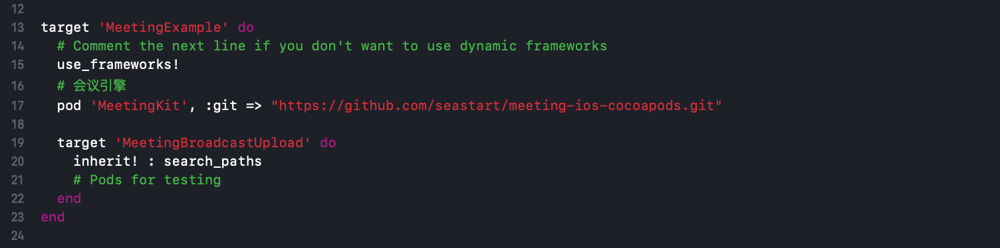

#### 4、为宿主工程添加后台权限
<font style="color:#333333;">工程宿主【TARGETS】->【Signing & Capabilities】->【Capability】，选择【Background Modes】，如图所示：</font>

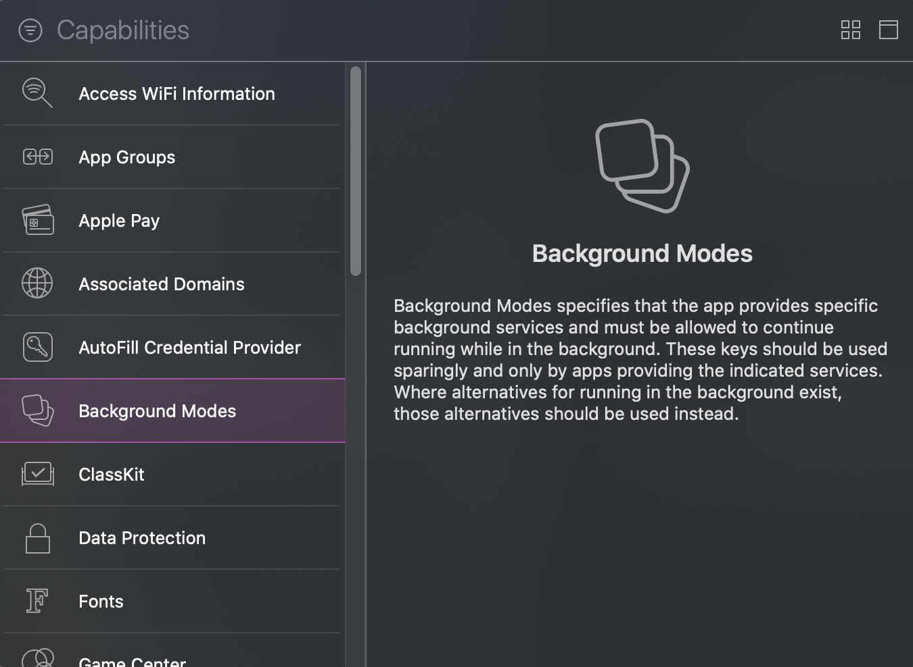

<font style="color:#333333;">双击添加后勾选【Audio, AirPlay, and Picture in Picture】选项，如下图所示：</font>

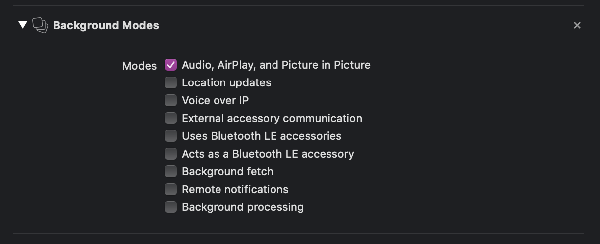

#### 5、为扩展工程添加 App Group
选中新增加的 Target，依次单击 + Capability，双击 App Groups，如下图：

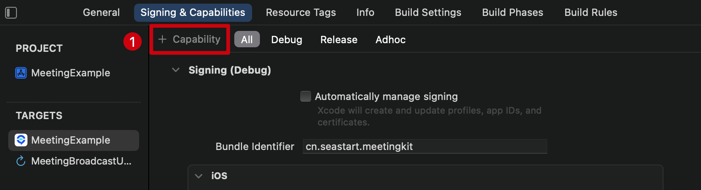

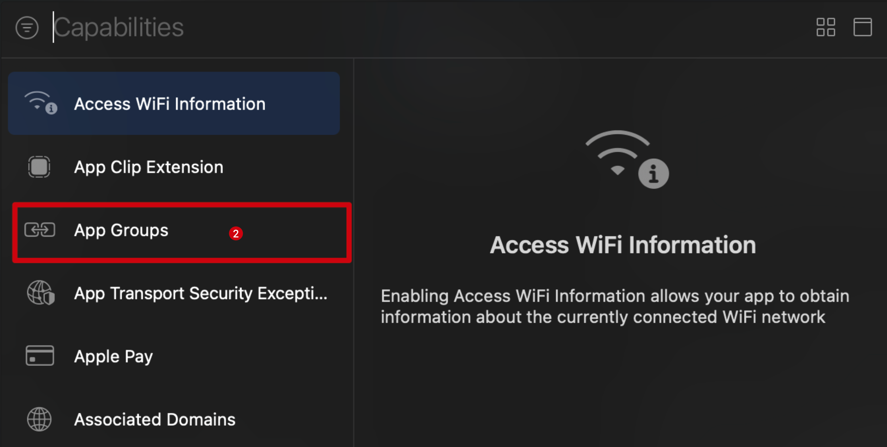

操作完成后，会在文件列表中生成一个名为 Target名.entitlements 的文件，如下图所示，选中该文件并单击 + 号填写上述步骤中的 App Group 即可。

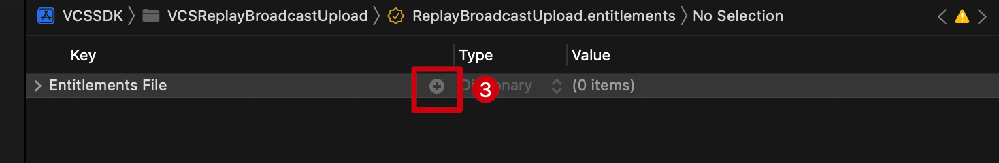

在新创建的 Target 中，Xcode 会自动创建一个名为 SampleHandler.h 的文件，用如下代码进行替换。需将代码中的 kAppGroup 改为上文中的创建的 App Group Identifier。

```objectivec
#import "SampleHandler.h"

/// Application Group Identifier
#define kAppGroup @"Application Group Identifier"

@interface SampleHandler() <MeetingKitScreenDelegate>

@end

@implementation SampleHandler

#pragma mark - 启动广播
- (void)broadcastStartedWithSetupInfo:(NSDictionary<NSString *, NSObject *> *)setupInfo {
    
    /// User has requested to start the broadcast. Setup info from the UI extension can be supplied but optional.
    [[MeetingKit sharedInstance] broadcastStartedWithAppGroup:kAppGroup delegate:self];
}

#pragma mark - 暂停广播
- (void)broadcastPaused {
    
    /// User has requested to pause the broadcast. Samples will stop being delivered.
}

#pragma mark - 恢复广播
- (void)broadcastResumed {
    
    /// User has requested to resume the broadcast. Samples delivery will resume.
}

#pragma mark - 完成广播
- (void)broadcastFinished {
    
    /// User has requested to finish the broadcast.
}

#pragma mark - 媒体数据(音视频)
/// 媒体数据(音视频)
/// - Parameters:
///   - sampleBuffer: 视频或音频帧
///   - sampleBufferType: 媒体类型
- (void)processSampleBuffer:(CMSampleBufferRef)sampleBuffer withType:(RPSampleBufferType)sampleBufferType {
    
    /// 媒体数据(音视频)发送
    [[MeetingKit sharedInstance] sendSampleBuffer:sampleBuffer withType:sampleBufferType];
}


#pragma mark - ----- MeetingKitScreenDelegate 代理方法 -----
#pragma mark 录屏完成回调
/// 录屏完成回调
/// @param engine 回调实例
/// @param reason 结束原因
- (void)broadcastFinished:(MeetingKit *)engine reason:(NSString *)reason {
    
    /// 声明描述
    NSString *describe = @"屏幕录制已结束";
    /// 构建Error信息
    NSError *error = [NSError errorWithDomain:NSStringFromClass(self.class) code:0 userInfo:@{NSLocalizedFailureReasonErrorKey : describe}];
    /// 完成屏幕录制
    [self finishBroadcastWithError:error];
}
```

### 接入流程
1、在需要使用录制服务的位置引入 `#import <MeetingKit/MeetingKit.h>` 并创建`RPSystemBroadcastPickerView`对象，如下图：

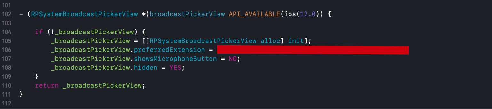

2、为实现业务细节，采用如下方式替换`RPSystemBroadcastPickerView`按钮，`broadcastButton`按钮事件后出现以下页面说明<font style="color:#333333;">扩展集成成功</font>：


3、宿主工程在初始化`MeetingKit`之后，实现屏幕共享状态回调：

```objectivec
/// 屏幕采集状态回调
/// @param status 状态码
- (void)onScreenRecordStatus:(SEAScreenRecordStatus)status {
    
    SGLOG(@"屏幕共享状态通知，status = %ld", status);
    
    switch (status) {
        case SEAScreenRecordStatusError:
            /// 屏幕采集连接错误
            break;
        case SEAScreenRecordStatusStop:
            /// 屏幕采集已经停止
            break;
        case SEAScreenRecordStatusStart:
            /// 屏幕采集已经开始
            break;
        default:
            break;
    }
}
```

4、屏幕扩展`SampleHandler`中实现`RTCScreenDelegate`代理：

```objectivec
@interface SampleHandler : NSObject <MeetingKitScreenDelegate>
/// 根据需要，在此处添加以下任何回调函数。
```

```objectivec
/// 录屏完成回调
/// @param engine 回调实例
/// @param reason 结束原因
- (void)broadcastFinished:(MeetingKit *)engine reason:(NSString *)reason {

    /// 声明描述
    NSString *describe = @"屏幕录制已结束";
    /// 构建Error信息
    NSError *error = [NSError errorWithDomain:NSStringFromClass(self.class) code:0 userInfo:@{NSLocalizedFailureReasonErrorKey : describe}];
    /// 完成屏幕录制
    [self finishBroadcastWithError:error];
}
```

5、屏幕扩展`SampleHandler`中实现开启屏幕录制功能：

```objectivec
- (void)broadcastStartedWithSetupInfo:(NSDictionary<NSString *,NSObject *> *)setupInfo {
    
    /// User has requested to start the broadcast. Setup info from the UI extension can be supplied but optional.
    [[MeetingKit sharedInstance] broadcastStartedWithAppGroup:@"Application Group Identifier" delegate:self];
}
```

6、屏幕扩展`SampleHandler`中实现发送共享屏幕帧数据：

```objectivec
- (void)processSampleBuffer:(CMSampleBufferRef)sampleBuffer withType:(RPSampleBufferType)sampleBufferType {
    
    /// 媒体数据(音视频)发送
    [[MeetingKit sharedInstance] sendSampleBuffer:sampleBuffer withType:sampleBufferType];
}
```


## 会议聊天
### 使用说明
进入房间后可以在"聊天"->"聊天窗口"进行文字、表情聊天以及传输和查看文件。

| **会中界面** | **聊天界面** | **上传文件** |
| --- | --- | --- |
| 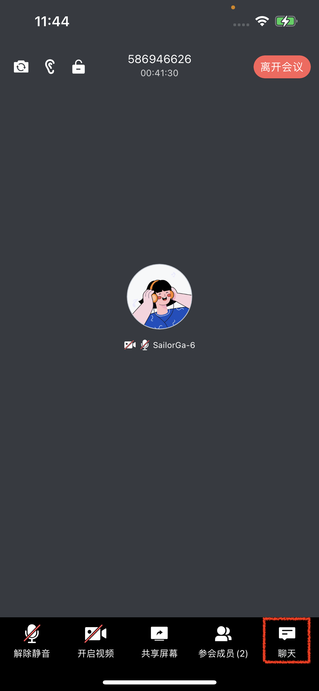 | 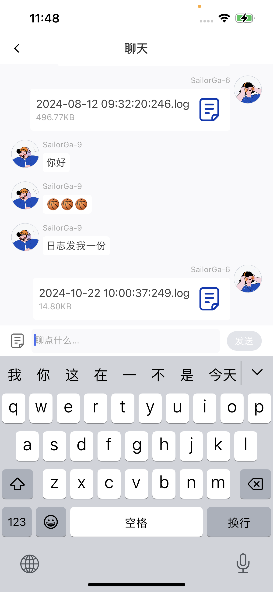 | 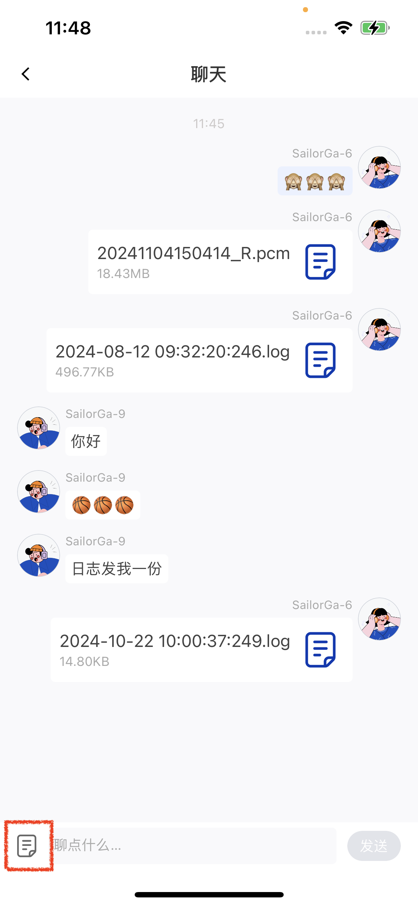 |


### 功能定制
如果当前的 UI 不满足您的需求，您可以修改通过修改源码来实现您满意的 UI 效果，请参考：

```objectivec
您可以通过修改 MeetingExample/Classes/Room/View/Message 目录下的源码来实现您满意的 UI 效果。

Message       
  └── FWRoomMessageViewController.h          // 聊天界面控制器
  └── FWRoomMessageTableSectionHeaderView.h      // 聊天界面分组头
  └── FWRoomMessageMineTableViewCell.h      // 自己的文本聊天信息单元格
  └── FWRoomMessageMineFileTableViewCell.h      // 自己的文本聊天信息单元格
  └── FWRoomMessageTableViewCell.h      // 成员的文本聊天信息单元格
  └── FWRoomMessageFileTableViewCell.h      // 成员的文件聊天信息单元格
```


