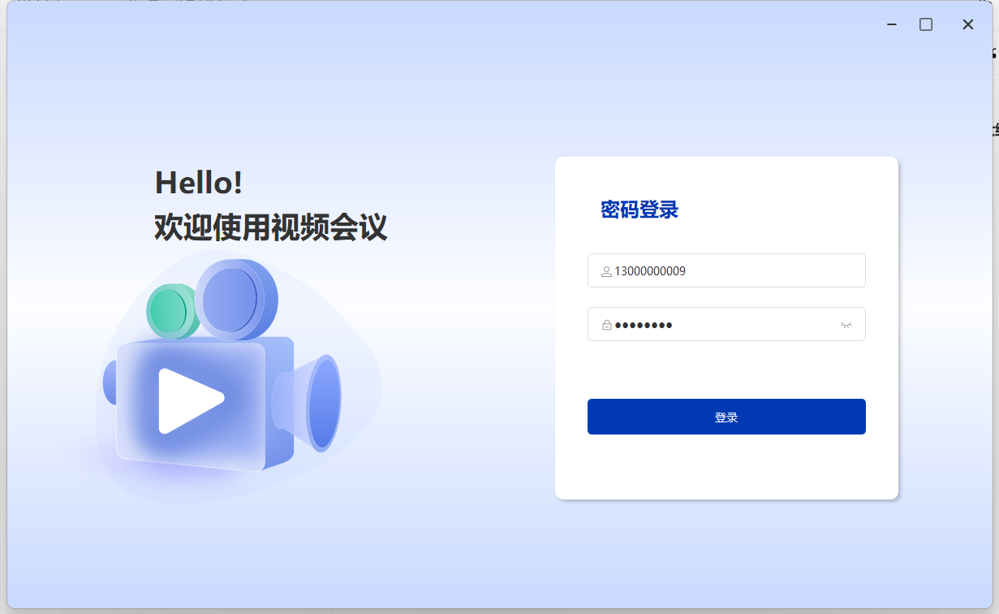
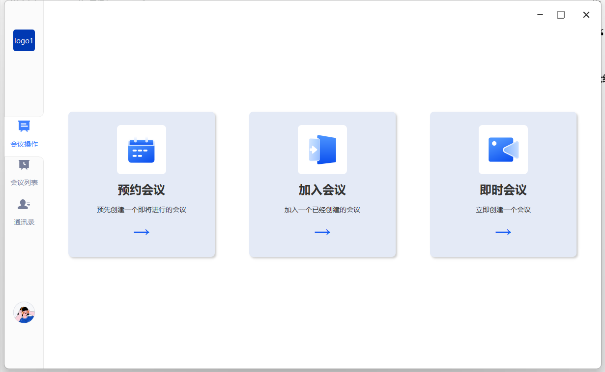
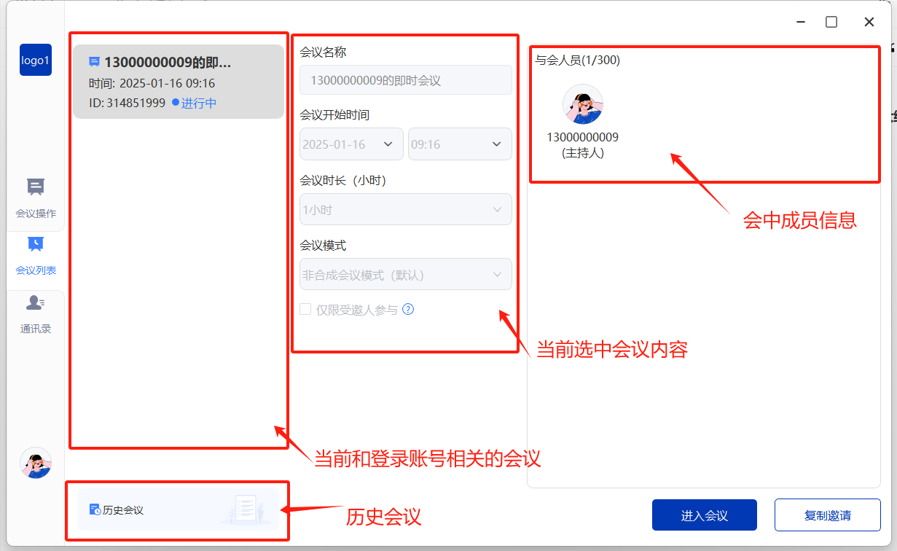
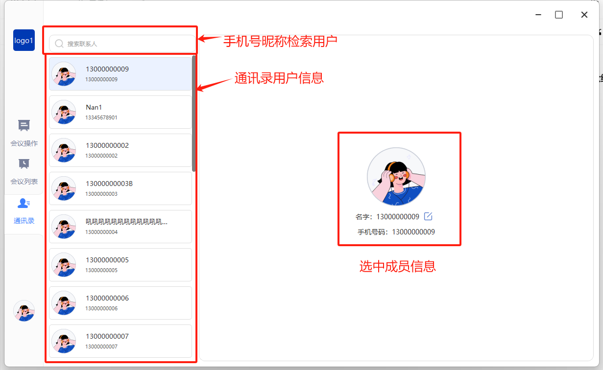
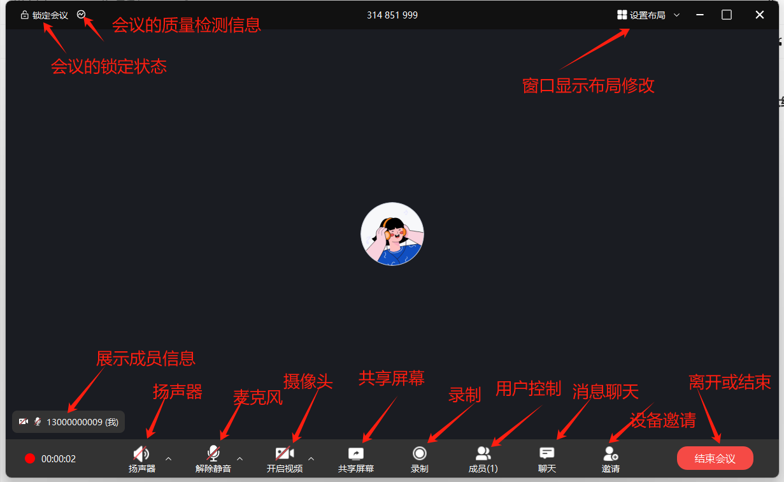
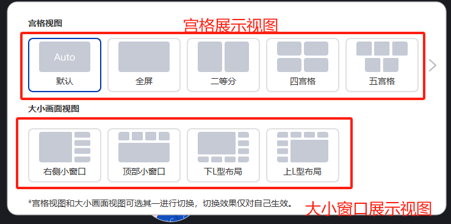
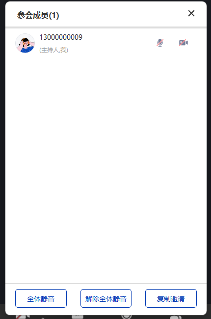
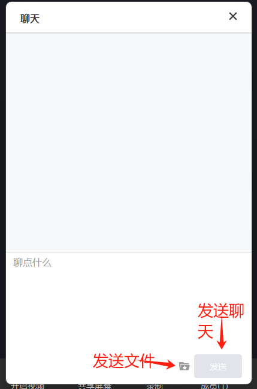
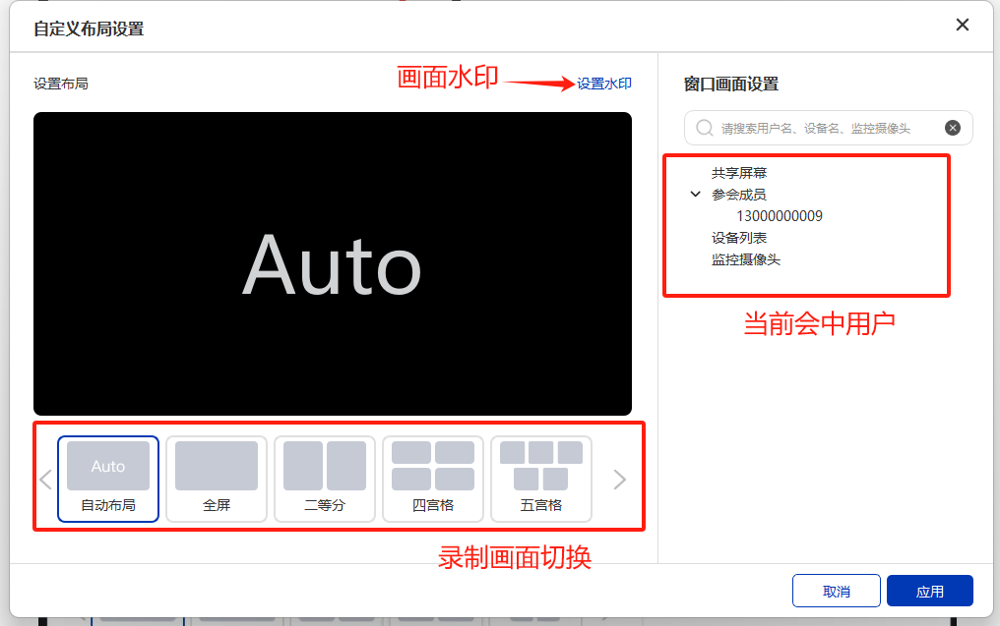
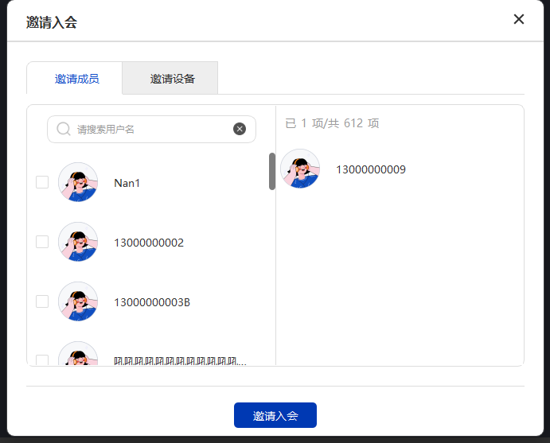

这是一个集成window SDK基于msvc + qt 构建的视频会议系统windows端项目。

github源码地址：[https://github.com/seastart/meeting-windows-demo](https://github.com/seastart/meeting-windows-demo)

### 目录结构介绍
```cpp
smeeting-windows-demo                   // 提供 C++（qt框架） 语言 Demo
├─ BaseWindows							//展示窗口父级（存放展示窗口的父类）
├─ CJsonObject            				// json解析
├─ DataModel             				// 数据实体类型
├─ Global                 				// 全局参数配置
├─ NetWork                				// 网络
├─ res                    				// 资源
│  ├─ Images              				// 图片资源
│  ├─ Qss              					// css 默认控件样式
├─ SMeetingSdk							// sdk 相关配置
│  ├─ SMeetControl              		// Meeting sdk 基本调用实现
├─ Tools                  				// 工具
├─ View                  				// 视图
│  ├─ Common              				// 通用视图
│  ├─ Home             					// 主窗口视图
│  │  ├─ MainView             			// 主窗口视图内的主要视图：通讯录，会议列表，会议预约界面
│  │  ├─ ToolView						// 主窗口视图内的弹框视图：历史会议，加入会议，改名，创建即使会议
│  │  ├─ ToolWidgets             		// 主窗口视图内的小控件视图
│  ├─ Login               				// 登录视图
│  ├─ Room	               				// 会中试图
│  │  ├─ Chat							//会中聊天UI及相关逻辑
│  │  ├─ Invite							//会中邀请设备UI及相关逻辑
│  │  ├─ Mcu							//会中录制及mcu布局修改UI及相关逻辑
│  │  ├─ Member							//会中成员控制UI及相关逻辑
│  │  ├─ RoomMain						//会中主要界面UI及相关逻辑
│  │  │  ├─ Layout						//会中窗口布局
│  │  │  │  ├─ Auto						//会中窗口布局-自动布局
│  │  │  │  ├─ Grid						//会中窗口布局-宫格布局
│  │  │  │  ├─ OneMore					//会中窗口布局-大小视图布局
│  │  ├─ Setting						//会中配置参数及质量检测UI及相关逻辑
│  │  ├─ Share							//会中共享窗口UI及相关逻辑
│  │  ├─ Tool							//会中工具窗口
│  ├─ Test                				// 测试视图
├─ MainWidget                			// 父级主窗口
├─ DemoControl                			// 快捷方法调用
```


### 集成方式
#### 直接加入代码
此ui demo 项目时通过 msvc+qt 工程编译生成。

如果您的开发语言，恰好也是msvc+qt 此方式，可以直接将整部代码拷贝到工程文件内。通过快捷方法调用内提供的方法（DemoControl.h）进行窗口的跳转或功能调用（当然了，您也可以修改其中代码将达到你想要的目的）

<font style="color:#DF2A3F;">注：因为使用了QWKWidgets 窗口请在QApplication 初始化前调用</font>

```cpp
QGuiApplication::setAttribute(Qt::AA_DontCreateNativeWidgetSiblings);
QApplication a(argc, argv);
...
reutrn a.exec();
```


#### 通过动态库方式
如果您的开发语言不是msvc+qt 此方式。没法将此代码加入到代码内。你可以使用编译好的dll 文件通过动态库链接的方式启动调用程序内代码。（如果没法编译，可以联系管理员提供相关文件）

快捷方法调用（DemoControl.h）内方法会以C语言的方式暴露出来，让大部分开发者调用启动此程序。

只需要加载其中的动态库，导出其中方法名即可直接调用

```csharp
//c# 加载方式（示例）
[DllImport(DllPath, CallingConvention = CallingConvention.Cdecl, ExactSpelling = true)]
public static extern int MEETING_DEMO_Init();
```

### 界面窗口展示
#### 登录界面
```cpp
代码目录
├─ View                  				// 视图
│  ├─ Login             				// 
│  │  ├─ WidLogin             			// 登录窗口视图
```




#### 主页面
```cpp
代码目录
├─ View                  				// 视图
│  ├─ Home             					// 
│  │  ├─ MainView             			// 
│  │  │  ├─ WidHome             		// 主页面
│  │  │  ├─ WidInvite             		// 会议预约
│  │  │  ├─ WidMeetingList             	// 会议列表
│  │  │  ├─ WidPhoneList             	// 通讯录
```



##### 会议列表



##### 通讯录



#### 会中主界面
```cpp
代码目录
├─ View                  				// 视图
│  ├─ Room	               				// 会中试图
│  │  ├─ Chat							//会中聊天UI及相关逻辑
│  │  ├─ Invite							//会中邀请设备UI及相关逻辑
│  │  ├─ Mcu							//会中录制及mcu布局修改UI及相关逻辑
│  │  ├─ Member							//会中成员控制UI及相关逻辑
│  │  ├─ RoomMain						//会中主要界面UI及相关逻辑
│  │  │  ├─ Layout						//会中窗口布局
│  │  │  │  ├─ Auto						//会中窗口布局-自动布局
│  │  │  │  ├─ Grid						//会中窗口布局-宫格布局
│  │  │  │  ├─ OneMore					//会中窗口布局-大小视图布局
│  │  ├─ Setting						//会中配置参数及质量检测UI及相关逻辑
│  │  ├─ Share							//会中共享窗口UI及相关逻辑
│  │  ├─ Tool							//会中工具窗口
```



##### 布局切换


##### 成员控制


##### 聊天消息



##### 录制界面设置



##### 成员&设备邀请


### 快捷方法调用
工程内添加了DemoControl 类，方便开发者快速的使用此工程内（此类内所有方法都会导出，开发者可以进行静态使用）

#### 参数设置定义
```csharp
#define MEETINGDEMO_SETTING_URL_S					0//字符串类型服务器地址
```

#### 窗口枚举定义
```csharp
#define MEETINGDEMO_VIEWTYPE_MAIN					1//程序主窗口
#define MEETINGDEMO_VIEWTYPE_MEETINGLIST			2//会议列表
#define MEETINGDEMO_VIEWTYPE_MailList				3//通讯录
#define MEETINGDEMO_VIEWTYPE_ROOM_Chat				4//房间内聊天窗口
#define MEETINGDEMO_VIEWTYPE_ROOM_MemberControl		5//房间内成员控制窗口
#define MEETINGDEMO_VIEWTYPE_ROOM_Setting			6//房间内设置&质量检测窗口
```

#### 布局枚举定义
```csharp
#define MEETINGDEMO_VIEWTYPE_Layout_AUTO		0//自动布局
#define MEETINGDEMO_VIEWTYPE_Layout_1			1//1宫格视图
#define MEETINGDEMO_VIEWTYPE_Layout_2			2
#define MEETINGDEMO_VIEWTYPE_Layout_4			4
#define MEETINGDEMO_VIEWTYPE_Layout_5			5
#define MEETINGDEMO_VIEWTYPE_Layout_6			6
#define MEETINGDEMO_VIEWTYPE_Layout_8			8
#define MEETINGDEMO_VIEWTYPE_Layout_9			9
#define MEETINGDEMO_VIEWTYPE_Layout_10			10
#define MEETINGDEMO_VIEWTYPE_Layout_12			12
#define MEETINGDEMO_VIEWTYPE_Layout_16			16
#define MEETINGDEMO_VIEWTYPE_Layout_25			25
#define MEETINGDEMO_VIEWTYPE_Layout_FULL		10000//全屏视图（无翻页按钮）
#define MEETINGDEMO_VIEWTYPE_Layout_L1_R4		1001  //左1右4

#define MEETINGDEMO_VIEWTYPE_Layout_B1_T4		1002  //上1下4

#define MEETINGDEMO_VIEWTYPE_Layout_LT1_BR7		1003  //左上1 右下7

#define MEETINGDEMO_VIEWTYPE_Layout_BR1_LT7		1004  //右下1 左上7
```

#### 方法说明
##### 整体初始化
```csharp
MEETING_DEMO_API int MEETING_DEMO_CALL MEETING_DEMO_Init();
```

只提供初始化功能，不会进行窗口的展示如需窗口的展示需要调用

MEETING_DEMO_ShowView(MEETINGDEMO_VIEWTYPE_MAIN);

##### 整体释放
```csharp
MEETING_DEMO_API int MEETING_DEMO_CALL MEETING_DEMO_Free();
```


##### 提供（sdk）用户快捷调用
```csharp
MEETING_DEMO_API int MEETING_DEMO_CALL MEETING_DEMO_Login(const char* name,const char* pass);
MEETING_DEMO_API int MEETING_DEMO_CALL MEETING_DEMO_Login(const char* token);
```

###### 参数
| name | 用户名 |
| --- | --- |
| pass | 密码 |
| token | sdk 登录所需的token |


<font style="color:#DF2A3F;">注：调用成功后，ui窗口如果已经展示，将跳转到主窗口视图</font>

##### 提供全局参数配置
```csharp
MEETING_DEMO_API int MEETING_DEMO_CALL MEETING_DEMO_SettingData(int tp,int idata,const char* sdata);
```

###### 参数
| tp | 参数类型 |
| --- | --- |
| pass | 密码 |
| token | sdk 登录所需的token |


<font style="color:#DF2A3F;">注：调用成功后，ui窗口如果已经展示，将跳转到主窗口视图</font>


##### 窗口跳转
```csharp
MEETING_DEMO_API int MEETING_DEMO_CALL MEETING_DEMO_GotoView(int tp);
```

###### 参数
| tp | 跳转窗口枚举 |
| --- | --- |


##### 显示隐藏窗口
```csharp
MEETING_DEMO_API int MEETING_DEMO_CALL MEETING_DEMO_ShowView(int tp);
MEETING_DEMO_API int MEETING_DEMO_CALL MEETING_DEMO_HideView(int tp);
```

###### 参数
| tp | 窗口枚举 |
| --- | --- |


<font style="color:#DF2A3F;">注意：初始化后，主界面默认时隐藏的。需要调用showView 显示主页面，您也可以通过直接进行登录入会后显示主页面。</font>

##### 修改更新窗口显示视图
```csharp
MEETING_DEMO_API int MEETING_DEMO_CALL MEETING_DEMO_RoomUpdateLayout(int tp);
```

###### 参数
| tp | 视图枚举 |
| --- | --- |


##### 获取版本信息
```csharp
MEETING_DEMO_API void MEETING_DEMO_CALL RTCEngine_Version(const char* version);
```

###### 参数
| version | 版本信息 |
| --- | --- |


<font style="color:#DF2A3F;">注：version必须是已经 分配内存的指针，至少100字节，此函式只负责版本信息的拷贝。</font>

