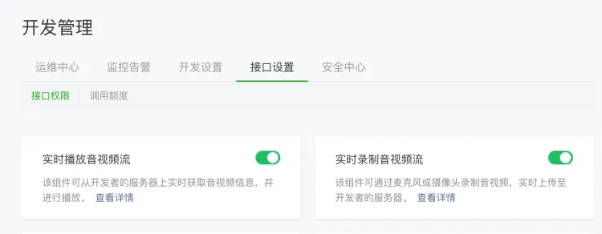
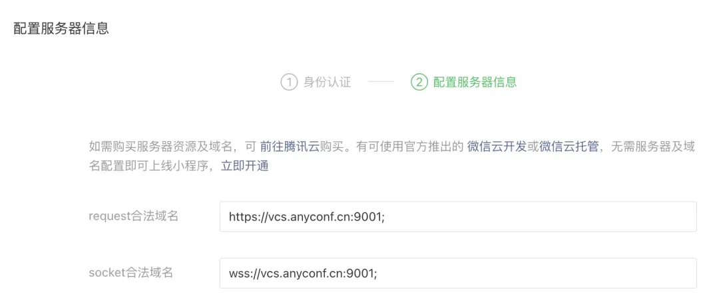

## 前提条件
开通小程序类目与推拉流标签权限（如不开通则无法正常使用）



根据项目配置合法域名




## 引用
### npm
```bash
npm install @seastart/smeeting-wx-sdk@latest --save
```

### **本地引用**
手动下载 sdk 包：

1. 下载 [smeeting-wx.js](https://www.unpkg.com/@seastart/smeeting-wx-sdk@latest/smeeting-wx.js) [smeeting-wx.d.ts](https://www.unpkg.com/@seastart/smeeting-wx-sdk@latest/smeeting-wx.d.ts) 
2. 将 `smeeting-wx.js` `smeeting-wx.d.ts` 复制到您的项目中。


## 使用
可通过本地引用，也可通过 [小程序构建npm](https://developers.weixin.qq.com/miniprogram/dev/devtools/npm.html) 直接引入。

```typescript
import SMeeting from './lib/smeeting-wx'; // 静态文件引入
// or
import SMeeting from '@seastart/smeeting-wx-sdk'; // 小程序构建npm引入
```

  
  


  
 

