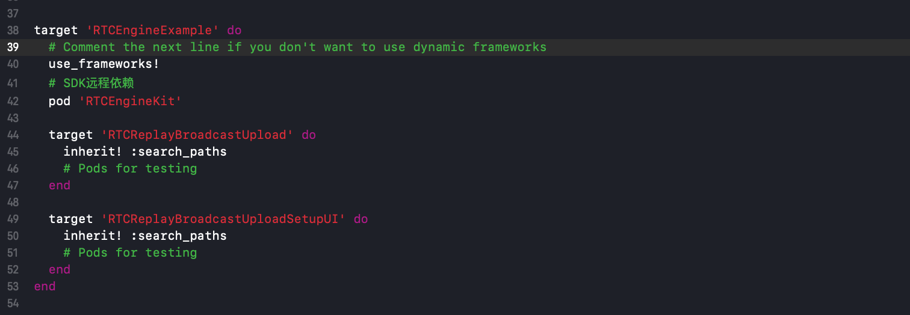
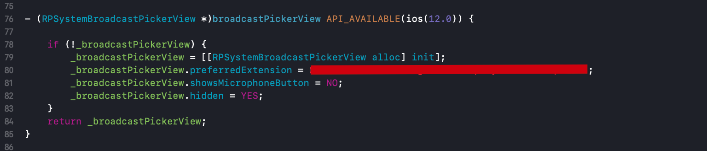
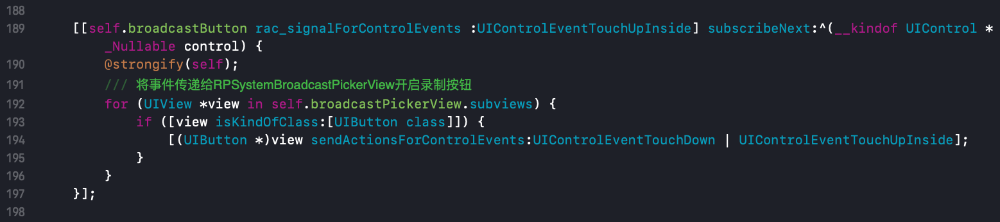

## 开发环境准备
Xcode 10及以上的版本，手机也必须升级至 iOS 12 以上，否则无法使用录屏特性。

#### 创建扩展程序
在现有工程选择【New】->【Target…】，选择【Broadcast Upload Extension】，如图所示：


配置好 Product Name。单击【Finish】后可以看到，工程多了所输 Product Name 的目录，目录下有个系统自动生成的 SampleHandler类，这个类负责录屏的相关处理；以及对应的Product Name SetupUI 的目录，目录下有个系统自动生成的 `BroadcastSetupViewController`类，这个类负责录屏的UI相关处理。

#### 为扩展添加SDK依赖
1. 手动集成方式需要将`RTCEngineKit.frameworknl`导入上述Product Name 的工程目录，并配置依赖的系统库；
2. 自动集成方式需更改`Podfile`文件，并执行`pod install`，如下图所示：



#### 为宿主添加后台权限
工程宿主【TARGETS】->【Signing & Capabilities】->【Capability】，选择【Background Modes】，如图所示：


双击添加后勾选【Audio, AirPlay, and Picture in Picture】选项，如下图所示：


## 对接流程
1. 在需要使用录制服务的位置引入 `#import <ReplayKit/ReplayKit.h>` 并创建`RPSystemBroadcastPickerView`对象，如下图：
2. 为实现业务细节，采用如下方式替换`RPSystemBroadcastPickerView`按钮，`broadcastButton`按钮事件后出现以下页面说明扩展集成成功：
3. 宿主工程在初始化`RTCEngineKit`之后，实现屏幕共享状态回调：

```objectivec
/// 屏幕共享状态回调
/// @param status 状态码
- (void)onScreenRecordStatus:(RTCScreenRecordStatus)status {
    
    /// 提示操作信息
    NSString *toastStr = @"屏幕共享连接错误";
    switch (status) {
        case RTCScreenRecordStatusError:
            toastStr = @"屏幕共享连接错误";
            break;
        case RTCScreenRecordStatusStop:
            toastStr = @"屏幕共享已经停止";
            break;
        case RTCScreenRecordStatusStart:
            toastStr = @"屏幕共享已经开始";
            break;
        default:
            break;
    }
    [FWToastBridge showToastAction:toastStr];
    SGLOG(@"%@", toastStr);
}
```typescript

4. 屏幕扩展`SampleHandler`中实现`RTCScreenDelegate`代理：

```objectivec
@interface SampleHandler : NSObject <RTCScreenDelegate>
/// 根据需要，在此处添加以下任何回调函数。
```

```objectivec
/// 录屏完成回调
/// @param engine 回调实例
/// @param reason 结束原因
- (void)broadcastFinished:(RTCEngineKit *)engine reason:(NSString *)reason {

    /// 声明描述
    NSString *describe = @"屏幕录制已结束";
    /// 构建Error信息
    NSError *error = [NSError errorWithDomain:NSStringFromClass(self.class) code:0 userInfo:@{NSLocalizedFailureReasonErrorKey : describe}];
    /// 完成屏幕录制
    [self finishBroadcastWithError:error];
}
```html

5. 屏幕扩展`SampleHandler`中实现开启屏幕录制功能：

```objectivec
- (void)broadcastStartedWithSetupInfo:(NSDictionary<NSString *,NSObject *> *)setupInfo {
    
    /// User has requested to start the broadcast. Setup info from the UI extension can be supplied but optional.
    [[RTCEngineKit sharedEngine] broadcastStartedWithAppGroup:@"Application Group Identifier" delegate:self];
}
```

6. 屏幕扩展`SampleHandler`中实现发送共享屏幕帧数据：

```objectivec
- (void)processSampleBuffer:(CMSampleBufferRef)sampleBuffer withType:(RPSampleBufferType)sampleBufferType {
    
    /// 媒体数据(音视频)发送
    [[RTCEngineKit sharedEngine] sendSampleBuffer:sampleBuffer withType:sampleBufferType];
}
```swift


