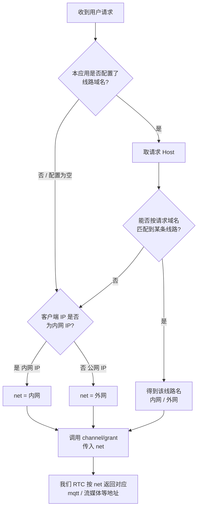

> 本文面向接入我们 RTC 服务的合作方（服务端应用层），说明 RTC 授权接口 `channel/grant` 中 `net` 参数的含义，以及如何在你们自己的服务端判断用户应走 `内网` 还是 `外网` 线路。

---

## 一、`net` 参数说明

- `net` 定义在我们（RTC 层）已部署的 RTC 服务上，一般情况下支持两个取值：**`内网`**、**`外网`** (可根据使用场景按需配置一个或多个网络线路)。
- 调用授权接口 **不传 `net` 时，默认按 `内网` 处理**。
- 我们（RTC）根据该参数，决定返回给客户端 SDK 的**实际服务地址**，包括：API服务、会控消息服务、流媒体服务等。
- 也就是说：**客户端最终连内网地址还是公网地址，完全由 `net` 这一个字段决定**。传错，客户端就会拿到错误的地址而连不上或走错线路。

---

## 二、你们（接入方）需要做的

你们在调用我们 RTC 的授权接口 `channel/grant` 时，必须在请求中带上约定好的 `net`（`内网` 或 `外网`）。

核心问题只有一句：**你们的服务端怎么知道这一次请求该填 `内网` 还是 `外网`？**

---

## 三、确定 `net` 的两种方式（任选其一）

### 方式 A：用户手动选择

```text
客户端列出全部线路（内网 / 外网）
  → 用户手动确认自己所在的线路
  → 客户端把选择结果发给你们的服务端
  → 你们服务端调用我们的 channel/grant 并传入 net
```

- 优点：最准确，不依赖任何网络判断。
- 缺点：每次需用户选择，体验稍重，且存在用户选错的可能。

### 方式 B：你们的服务端智能判断（推荐，可参考我们的 Demo 实现）

```text
你们的服务端收到自己用户的请求
  → 自动判断该用户是内网还是外网
  → 调用我们的 channel/grant 并传入 net
```

- 优点：对用户无感，自动分流。
- 缺点：需在你们服务端实现一小段判断逻辑（逻辑很简单，见下文伪代码）。

> 说明：本项目中的 Demo 是一个**服务端应用层的参考实现**，它内部正是采用方式 B 来判断 `net`。你们不必使用 Demo，只需在自己的服务端照同样的判断逻辑算出 `net`，再调用我们的 `channel/grant` 即可。

---

## 四、线路判断流程图



> 匹配规则说明：判断节点中的"按请求域名匹配到线路"，指**请求 Host 包含该线路所配置的域名串**（子串包含匹配，而非完全相等）。例如线路配置了 `example.com`，则 `meeting.example.com` 也会命中该线路。

---

## 五、`matchNetwork` 判断逻辑（伪代码）

方式 B 的判断逻辑如下，可直接翻译到任意语言：

```text
function matchNetwork(request):
    # 1. 读取本应用的线路配置（来自你们自己的配置文件，可能为空）
    #    配置格式: 线路名@域名1,域名2;线路名@域名3
    #    例: "内网@lan.example.com;外网@wan.example.com"
    #    注意：配置可能不存在/为空，此时直接进入第 3 步兜底
    config = readLineConfig(appId)

    # 2. 若配置了线路，按请求域名匹配
    if config is not empty:
        lineMap = parse(config)        # 解析为 {线路名: [域名...]}
        host = request.host
        for lineName, domains in lineMap:
            for domain in domains:
                if host contains domain:
                    return lineName     # 命中即返回对应的线路（内网/外网）

    # 3. 未配置 或 域名未命中，按客户端 IP 兜底判断
    clientIP = request.clientIP
    if isInternalIP(clientIP):
        return "内网"
    else:
        return "外网"

function isInternalIP(ip):
    # 满足以下任一类，均视为内网
    return ip in 10.0.0.0/8        # 私有地址 A 类
        or ip in 172.16.0.0/12     # 私有地址 B 类
        or ip in 192.168.0.0/16    # 私有地址 C 类
        or ip in 127.0.0.0/8       # 环回地址
        or ip in 100.64.0.0/10     # 运营商级 NAT (CGNAT)
```

**逻辑要点**：

1. 优先用**访问域名**匹配——你们给不同线路配置不同入口域名，用户从哪个域名进来就判为哪条线路，最准。
2. 域名没配置或没匹配上，再用**客户端 IP** 兜底：内网 IP → `内网`，公网 IP → `外网`。
3. 最终传给我们的 `net` 只能是 `内网` 或 `外网` 之一。

> 说明：上面伪代码里的线路名 / 域名只是格式示例，真实取值来自你们自己的配置文件，且配置文件可能为空（为空则走第 3 步 IP 兜底）。

---

## 六、对齐与注意事项

1. 传给我们的 `net` **必须是 `内网` 或 `外网`**，不传则默认 `内网`；请勿传未约定的其他值。
2. 若你们网络环境简单、用户来源清晰，**方式 B（域名匹配 + IP 兜底）** 最省事，照上方伪代码实现即可。
3. 若你们内网 / 外网边界复杂、自动判断容易误判，建议用**方式 A（用户手动选择）**，最不容易出错。
4. 建议上线前用内网、外网两类用户分别验证一次，确认实际拿到的 `mqtt`、流媒体地址符合预期。

---

## 七、反向代理（Nginx）注意事项

上文的线路判断依赖两个关键信息：**请求域名 `Host`**（用于域名匹配）和**客户端真实 IP**（用于内网/外网兜底）。如果你们的服务前面有 Nginx 等反向代理，必须正确转发这两类信息，否则域名匹配会拿到代理机域名、IP 兜底会误判为代理机的内网 IP。

Nginx 关键配置示例：

```nginx
proxy_set_header Host $host;
proxy_set_header X-Real-IP $remote_addr;
proxy_set_header X-Forwarded-For $proxy_add_x_forwarded_for;
proxy_set_header X-Forwarded-Proto $scheme;
```

各指令说明：

- `Host $host`：把用户实际访问的域名透给后端，保证域名匹配逻辑拿到的是真实入口域名。
- `X-Real-IP $remote_addr`：传递客户端真实 IP。
- `X-Forwarded-For $proxy_add_x_forwarded_for`：追加客户端 IP 到转发链，便于后端按可信头取真实 IP。
- `X-Forwarded-Proto $scheme`：传递原始访问协议（http/https），如你们有协议相关判断可据此识别。

> 提示：后端取客户端 IP 时，应优先读取 `X-Real-IP` / `X-Forwarded-For` 等可信头（并限制仅信任代理机来源），而不是取 TCP 对端地址，否则拿到的是 Nginx 的 IP 而非用户 IP。
