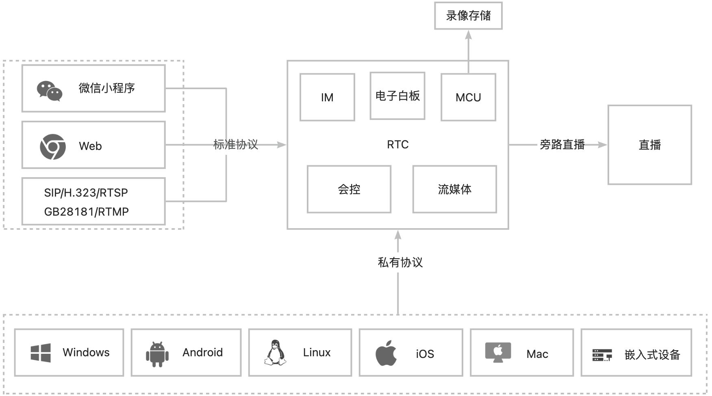

融合音视频通信组件，以低延迟音视频和多人实时互动为基础，结合标准音视频协议融合、MCU录制、私有化直播等服务，通过公有云、私有云、混合云部署等方式，为开发者搭建低成本音视频互动解决方案。

### 产品架构
实时音视频互动组件主打全平台互通的多人音视频通话和低延时互动解决方案，提供小程序、Web、Android、iOS、Windows、Linux 等平台的 SDK 便于开发者快速集成并与第三方私有云服务后台连通。通过不同产品间的相互联动，还能简单快速地实现即时通信 、电子白板等功能，扩展更多的业务场景。产品架构如下图所示：

### 平台支持
全平台互通的音视频解决方案。

| **平台** | **版本** | **下载地址** |
| --- | :--- | :--- |
| iOS | | |
| Android | | |
| Windows | | |
| Mac OS | | |
| Web | | |
| 微信小程序 | | |
| 全平台C++ | | |

