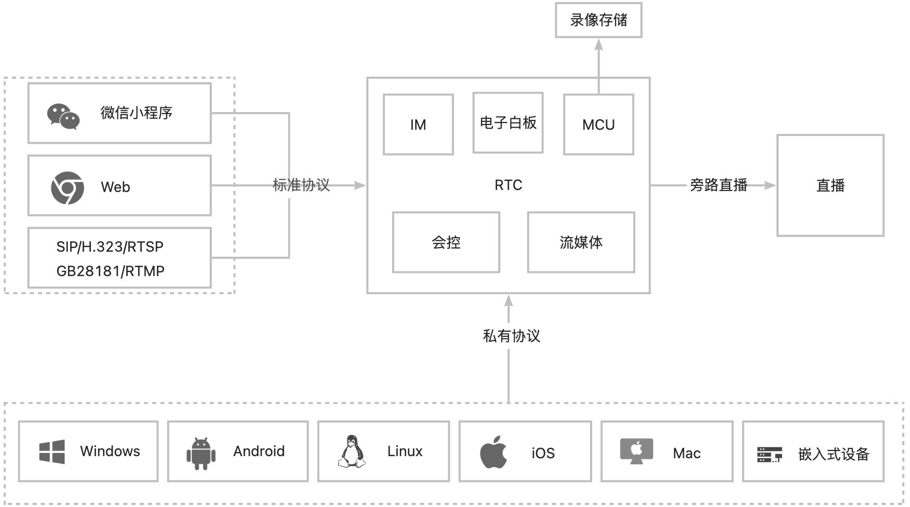

融合音视频通信组件，以低延迟音视频和多人实时互动为基础，结合标准音视频协议融合、MCU录制、私有化直播等服务，通过公有云、私有云、混合云部署等方式，为开发者搭建低成本音视频互动解决方案。

如果你还在 SRTC 和 SMeeting 之间犹豫，先看 [怎么选](/zh/choose)。

### 产品架构

实时音视频互动组件主打全平台互通的多人音视频通话和低延时互动解决方案，提供小程序、Web、Android、iOS、Windows、Linux 等平台的 SDK，便于开发者快速集成并与第三方私有云服务后台连通。通过不同产品间的相互联动，还能实现即时通信、电子白板等能力，扩展更多业务场景。

SRTC 只负责音视频通道本身，**不带用户体系、不带业务规则** —— 这两块由你的后端决定，通过服务端 API 与 SRTC 协同。

### 平台支持

全平台互通，各端行为对齐。

| 平台 | 说明 | 文档 |
| --- | --- | --- |
| Web | 浏览器端，也覆盖微信小程序（`web-view` 嵌入） | [集成](/zh/rtc/web/integration) · [快速开始](/zh/rtc/web/quickstart) |
| Android | 手机、盒子、嵌入式设备 | [集成](/zh/rtc/android/integration) · [快速开始](/zh/rtc/android/quickstart) |
| Windows | 桌面客户端，C++ 接口 | [集成](/zh/rtc/windows/integration) · [快速开始](/zh/rtc/windows/quickstart) |
| Swift | iOS 与 macOS，`import SRTC` | [集成](/zh/rtc/swift/integration) · [快速开始](/zh/rtc/swift/quickstart) |
| iOS | Objective-C，`RTCEngineKit` | [集成](/zh/rtc/ios/integration) · [快速开始](/zh/rtc/ios/quickstart) |
| C | 服务端与嵌入式，纯 C 接口 | [集成](/zh/rtc/capi/integration) · [快速开始](/zh/rtc/capi/quickstart) |
| 服务端 | HTTP 接口与事件回调 | [服务端 API](/zh/rtc/server-api/overview) |

<Note>
各端的获取方式不同：Web 走 npm、Android 走 Maven、Windows 从制品仓库下载 zip，均见对应的集成页。
Swift 走 Swift Package Manager（预编译 XCFramework）。iOS、C SDK 的安装包请向我们获取。
</Note>

