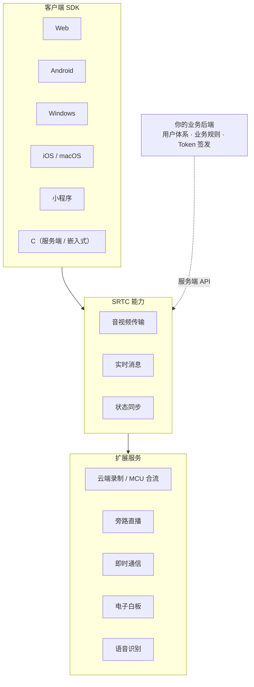

融合音视频通信组件，以低延迟音视频和多人实时互动为基础，结合标准音视频协议融合、MCU录制、私有化直播等服务，通过公有云、私有云、混合云部署等方式，为开发者搭建低成本音视频互动解决方案。

如果你还在 SRTC 和 SMeeting 之间犹豫，先看 [怎么选](/zh/choose)。

### 产品架构

实时音视频互动组件主打全平台互通的多人音视频通话和低延时互动解决方案，提供小程序、Web、Android、iOS、Windows、Linux 等平台的 SDK，便于开发者快速集成并与第三方私有云服务后台连通。通过不同产品间的相互联动，还能实现即时通信、电子白板等能力，扩展更多业务场景。

```mermaid
flowchart TB
    subgraph 客户端["客户端 SDK"]
        direction LR
        S1["Web"]
        S2["Android"]
        S3["Windows"]
        S4["iOS / macOS"]
        S5["小程序"]
        S6["C（服务端 / 嵌入式）"]
    end

    subgraph 能力["SRTC 能力"]
        direction LR
        C1["音视频传输"]
        C2["实时消息"]
        C3["状态同步"]
    end

    subgraph 扩展["扩展服务"]
        direction LR
        E1["云端录制 / MCU 合流"]
        E2["旁路直播"]
        E3["即时通信"]
        E4["电子白板"]
        E5["语音识别"]
    end

    Biz["你的业务后端<br/>用户体系 · 业务规则 · Token 签发"]

    客户端 --> 能力
    能力 --> 扩展
    Biz -.服务端 API.-> 能力
```

### 平台支持
全平台互通的音视频解决方案。

| **平台** | **版本** | **下载地址** |
| --- | :--- | :--- |
| iOS | | |
| Android | | |
| Windows | | |
| Mac OS | | |
| Web | | |
| 微信小程序 | | |
| C（服务端/嵌入式） | | |

