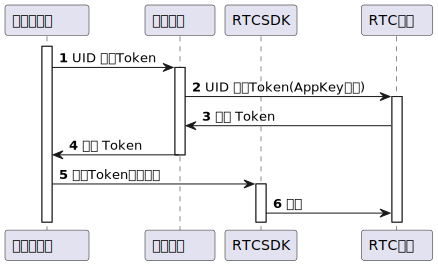

RTC音视频互动组件剥离了业务，业务平台对接不需要考虑帐号体系的问题，所有的业务处理都交由第三方业务平台来设计，RTC只保留了最核心也是实现难度最大的几点

    - 实时的消息传输
    - 状态同步与维护
    - 音视频传输

在保障灵活性的前提下，所有功能的接入仍然非常的简单。

## 基本概念
### 频道
频道(`Channel`)是一个音视频空间（可以理解为一场会议），同一频道内的用户可以互相接收对方的实时音视频数据。频道名和频道信息都由业务方自定义。

#### 频道的打开与销毁
+ 频道可手动打开（如需要提前设置一些频道扩展属性）
+ 第一个用户加入频道时如果频道未打开，自动打开
+ 频道开启后2小时内无人加入，或最后一个用户离开频道2小时后，会自动销毁

### 用户
RTC没有自己的用户(`User`)体系，所有用户信息都需要由业务方来自定义。

RTC平台uid与频道的关系

+ 一个uid可以同时加入多个不同频道（如需要限制一个uid同时只能进入一个频道，如只能进入一个会，由业务后台自身进行限制）
+ 同一个uid加入同一个频道，后加入的会顶掉前一个加入的

一般业务后端可以将自己平台的用户uid作为RTC的uid。

如果要支持一个业务用户进入同一个频道而不互顶，可以用sessionId作为RTC的uid，这样一个业务用户可以使用多个RTC身份。

### 音视频流轨道
每一路音频、每一路视频，都是一个流轨道(`Track`)，一个用户可以发布多个本地音视频流轨道，也可订阅多个远端音视频流轨道。

轨道的音视频流数据由RTC SDK进行传输，每一个轨道的业务意义由业务方自定义。

## 准备条件
在开始集成之前，首先需要申请应用，在应用申请成功之后，你会得到一个AppID和一个AppKey, 开发者需要自己保管好AppKey，不要部署在客户端上或者在网络上传输

SDK加入频道前需要得到一个token，token的获取流程如下：

在调试阶段，开发者可以从开发者后台中生成临时token。

### 
