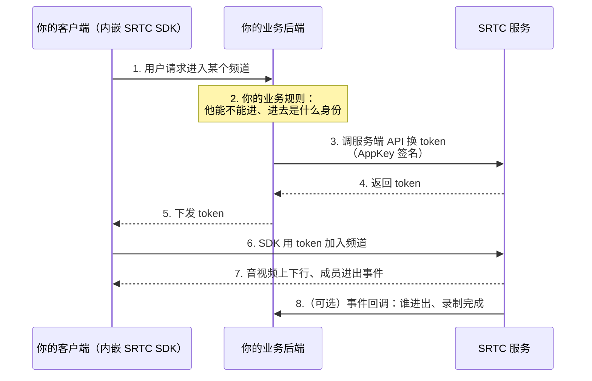

本页给出接入 SRTC 的最短路径。先看清分工，再照平台入口往下走。

---

## 谁负责什么

一次接入涉及四个角色：**两个是你的，两个是我们的**。

| 角色 | 谁做 | 负责什么 |
| --- | --- | --- |
| **你的客户端** | 你 | 界面与交互：入口按钮、画面布局、成员列表、按钮状态。音视频能力靠内嵌我们的 SDK 获得 |
| **你的业务后端** | 你 | 用户体系与业务规则：谁是合法用户、谁能进这个频道。用 `AppKey` 调我们的服务端 API |
| **我们的 SDK** | 我们 | 采集、编解码、传输、信令、状态同步、事件回调。它是一个库，跑在你的客户端里 |
| **我们的服务端** | 我们 | 媒体转发、会话状态、录制 / 直播 / 转推，以及给你的后端调用的服务端 API |

一句话记住这条边界：**我们不碰你的用户体系，你不碰媒体流。**

+ 你不需要在我们这边注册用户 —— `uid` 直接用你业务系统里现成的用户 ID
+ 音视频数据不经过你的服务器 —— 客户端直连我们的媒体服务，你的带宽账单不会因为开会而涨


```mermaid
sequenceDiagram
    participant FE as 你的客户端（内嵌 SRTC SDK）
    participant BE as 你的业务后端
    participant SRTC as SRTC 服务

    FE->>BE: 1. 用户请求进入某个频道
    Note over BE: 2. 你的业务规则：<br/>他能不能进、进去是什么身份
    BE->>SRTC: 3. 调服务端 API 换 token<br/>（AppKey 签名）
    SRTC-->>BE: 4. 返回 token
    BE-->>FE: 5. 下发 token
    FE->>SRTC: 6. SDK 用 token 加入频道
    SRTC-->>FE: 7. 音视频上下行、成员进出事件
    SRTC->>BE: 8.（可选）事件回调：谁进出、录制完成
```

整条链路里，**你的后端负责「换钥匙」，你的客户端负责「用钥匙」**，媒体走我们，业务判断走你。

---

## 接入前

三件事按顺序做完，再去看具体平台的文档：

<Steps>
<Step title="申请应用">
拿到 **AppID** 和 **AppKey**。AppKey 是服务端密钥，绝不能放进客户端 —— 详见 [Token 与鉴权](/zh/rtc/token)。
</Step>

<Step title="理解模型">
SRTC 只有三个对象：频道、用户、流轨道。它不带用户体系，也不带业务规则。花五分钟读一遍 [核心概念](/zh/rtc/key-concepts)，后面所有接口都会好懂很多。
</Step>

<Step title="打通 Token 签发">
上图第 3 步，是整个接入里**唯一必须写的服务端代码**：校验完你自己的用户身份后，用 AppKey 签名调我们的 grant 接口，把 token 返给客户端。

调试阶段可以先在开发者后台生成临时 Token 跑通客户端，正式环境必须走后端签发。后端这段怎么封装、权限边界怎么划，有一份现成的说明：[业务后端参考实现](/zh/rtc/server-api/server-demo)。
</Step>
</Steps>

---

## 选择你的平台

| 平台 | 入口 |
| --- | --- |
| Web | [集成](/zh/rtc/web/integration) · [快速开始](/zh/rtc/web/quickstart) |
| Android | [集成](/zh/rtc/android/integration) · [快速开始](/zh/rtc/android/quickstart) |
| Windows | [集成](/zh/rtc/windows/integration) · [快速开始](/zh/rtc/windows/quickstart) |
| Swift（iOS / macOS） | [集成](/zh/rtc/swift/integration) · [快速开始](/zh/rtc/swift/quickstart) |
| iOS（Objective-C） | [集成](/zh/rtc/ios/integration) · [快速开始](/zh/rtc/ios/quickstart) |
| C（服务端 / 嵌入式） | [集成](/zh/rtc/capi/integration) · [快速开始](/zh/rtc/capi/quickstart) |
| 服务端 | [服务端 API](/zh/rtc/server-api/overview) |

<Note>
微信小程序场景建议用 `<web-view>` 嵌入基于 Web SDK 实现的页面，一套代码同时覆盖浏览器和小程序。详见 [Web SDK 集成](/zh/rtc/web/integration)。
</Note>

---

## 典型接入顺序

各端 API 名称不同，但流程是一致的：

```text
初始化 SDK
  → 设置事件回调          （必须在加入频道前，否则会漏掉早期事件）
  → 加入频道（用 token）
  → 采集并发布本地轨道
  → 订阅远端轨道并渲染
  → 离开频道 → 释放资源
```

<Tip>
最容易踩的坑是**回调注册晚于加入频道** —— 那样会漏掉"已在频道内的用户"这批事件，表现为进会后看不到别人。各端文档的快速开始都按正确顺序给了示例。
</Tip>

---

## 几个最常问的边界问题

**音视频要经过我的服务器吗？** 不需要。客户端直连我们的媒体服务，你的后端只参与鉴权和业务判断。

**用户要先在你们那边注册吗？** 不需要。我们不存你的用户资料，`uid` 用你自己的用户 ID 即可。

**AppKey 放前端会怎样？** 拿到它的人可以签发任意用户身份的 token、踢人、销毁频道。它只能待在服务端。

**权限规则谁来判？** 你。我们只认签发出来的 token 里写了什么，「这个人能不能进这个频道」是你的后端在第 2 步做的判断。

---

## 如果你要做的是会议

主持人、举手、静音全场、等候室这些不在 SRTC 里，需要自己实现。如果你的形态本来就是会议产品，先看一眼 [选 SRTC 还是 SMeeting](/zh/choose) 再决定从哪一层接入。
