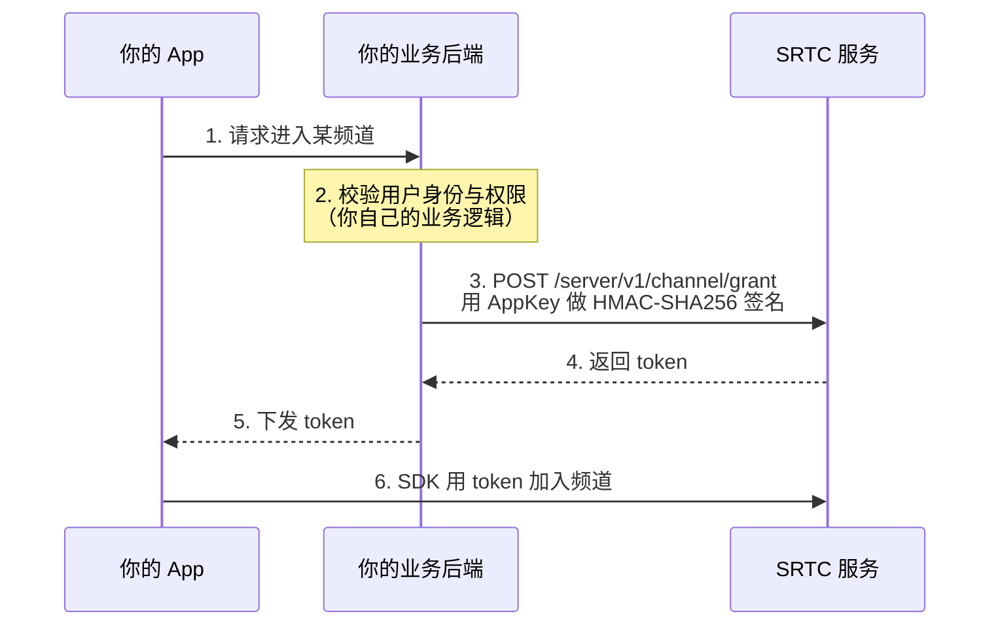

客户端加入频道需要一个 Token。这个 Token **只能由你的业务后端签发**，不能在客户端生成。本页说明整条链路。

---

## AppID 与 AppKey

申请应用后你会拿到一对凭据，职责完全不同：

| 凭据 | 用途 | 能否出现在客户端 |
| --- | --- | --- |
| **AppID** | 标识你的应用 | 可以 |
| **AppKey** | 服务端调用接口时的签名密钥 | **绝对不可以** |

<Warning>
**AppKey 泄露等于应用被接管。** 拿到它的人可以签发任意用户身份的 Token、踢人、销毁频道。

它不能出现在：客户端代码、前端配置文件、移动 App 包体、Git 仓库、日志。只能存在于你自己的服务端。
</Warning>

---

## 签发流程

关键点在第 2 步：**SRTC 不管你的用户体系**。谁有资格进这个频道、进去以后是什么身份，全部由你的后端判断。SRTC 只认签发出来的 Token。

接口详情见 [服务端 API · 获取加入频道 token](/zh/rtc/server-api/channel)，签名算法见 [服务端 API 概览](/zh/rtc/server-api/overview)。

<Tip>
调试阶段不想先搭后端，可以在开发者后台直接生成临时 Token 跑通客户端流程。**临时 Token 只用于调试**，正式环境必须走后端签发。
</Tip>

---

## uid 怎么定

Token 里签的 `uid` 就是这个用户在频道里的身份。规则有两条要先想清楚：

+ 一个 uid **可以同时加入多个不同频道**
+ 同一个 uid 加入**同一个**频道，后加入的会把先加入的顶掉

所以：

| 你的需求 | uid 怎么取 |
| --- | --- |
| 一个用户同时只能有一个在线身份（常规） | 直接用你业务系统的用户 ID |
| 同一用户要多端同时在线，互不顶替 | 用「用户 ID + 设备标识」或 sessionId 拼一个唯一值 |

<Note>
如果你需要的是"一个用户在多个设备上同时参会"这种会议语义，SMeeting 已经内置了按设备类型区分身份的机制，不用自己拼 uid。见 [怎么选](/zh/choose)。
</Note>

---

## 有效期与失效

Token 与一次会话绑定，用掉之后就不能重复使用：

| 现象 | 服务端错误码 | 原因 |
| --- | --- | --- |
| 加入失败 | `1021` ChannelTokenUsed | 这个 Token 已经被用过，需要重新签发 |
| 加入失败 | `1032` SidNotFound | 会话已不在线（例如进程退出后又用同一个 Token） |
| 加入失败 | `1002` HeaderInvalidAppId | AppID 无效 |
| 后端调接口失败 | `1003` HeaderInvalidSignature | 签名算错，检查拼接顺序和 AppKey |

完整错误码见 [服务端 API · 错误码](/zh/rtc/server-api/error-codes)。

<Warning>
**每个客户端实例都要单独签发一个 Token。** 用同一个 Token 起两个进程，第二个会拿到 `1032`。测试多端互通时，每一端各取各的。
</Warning>

---

## 相关

+ [核心概念](/zh/rtc/key-concepts) —— 频道、用户、流轨道
+ [服务端 API 概览](/zh/rtc/server-api/overview) —— 签名算法与请求格式
