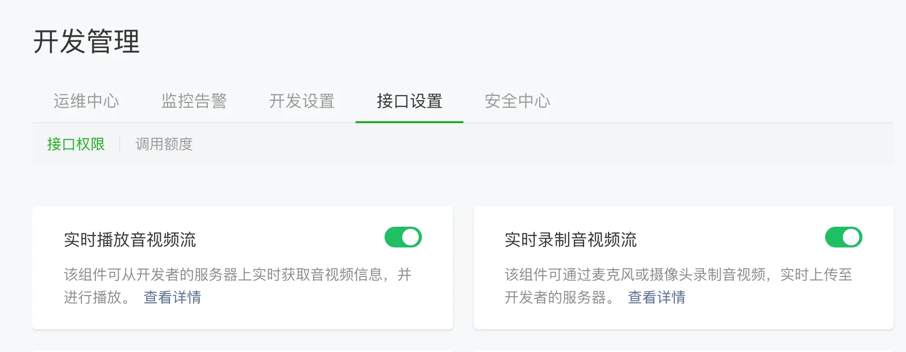
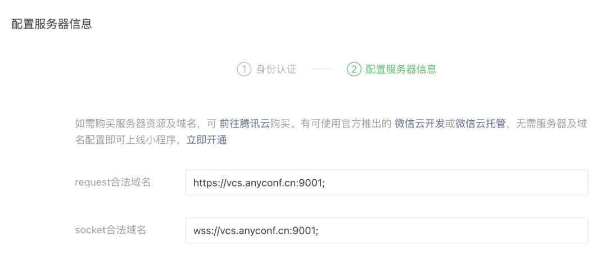

## 前提条件
开通小程序类目与推拉流标签权限（如不开通则无法正常使用）

### 
根据项目配置合法域名




## 引用
### npm
```bash
npm install @seastart/srtc-wx-sdk@latest --save
```typescript


### 本地引用
手动下载 sdk 包：

1. 下载 [srtc-wx.js](https://www.unpkg.com/@seastart/srtc-wx-sdk@latest/srtc-wx.js)  [srtc-wx.d.ts](https://www.unpkg.com/@seastart/srtc-wx-sdk@latest/srtc-wx.d.ts) 
2. 将 `srtc-wx.js``srtc-wx.d.ts`复制到您的项目中。


## 使用
可通过本地引用，也可通过 [小程序构建npm](https://developers.weixin.qq.com/miniprogram/dev/devtools/npm.html) 直接引入。


```typescript
import SRTC from './lib/srtc-wx'; // 静态文件引入

import SRTC from '@seastart/srtc-wx-sdk'; // 小程序构建npm引入
```


