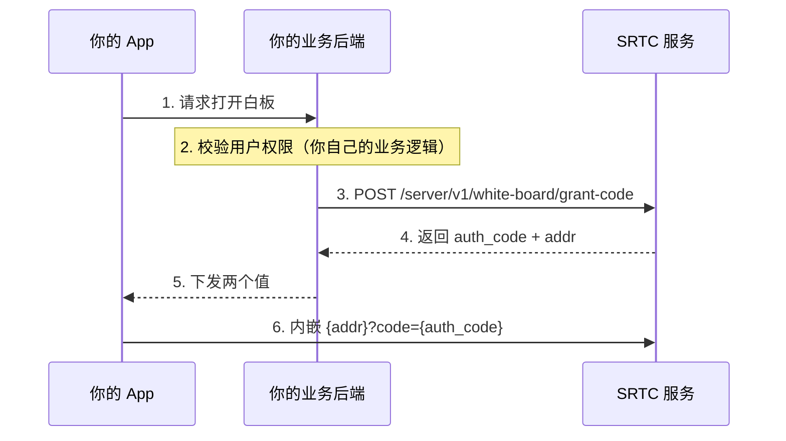
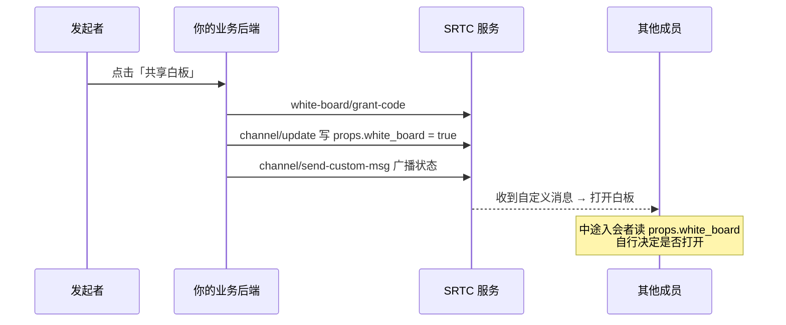

SRTC 的电子白板是一个**由 SRTC 服务托管的 H5 页面**，你把它嵌进自己的界面（Web 用 `iframe`，原生端用 WebView）就能用。笔迹同步走白板自己的信令通道，**不占用频道的流轨道**，也不影响音视频。

所以对接白板的工作量，本质上只有两件事：**拿到一个带授权码的页面地址**，以及**决定什么时候把它显示出来**。

---

## 板子与频道的关系

白板的标识叫 `board`（板子 ID），字符集限制与频道名相同。**用同一个 `board` 的人就在同一块板上**。

`board` 与频道没有强绑定，两种用法都成立：

| 用法 | `board` 取值 | 适用场景 |
| --- | --- | --- |
| 会议白板（推荐） | 直接取频道名 | 会议与白板一一对应，会中所有人天然进同一块板 |
| 独立白板 | 自定义 ID | 白板不依附于任何一次通话，比如课件板、长期留存的项目板 |

<Warning>
取频道名的代价是**跟着频道一起消失**：频道销毁时会连带销毁同名白板，而频道在无人 2 小时后自动销毁。要让内容长期留存，`board` 就不能取频道名。详见下文[生命周期](#生命周期与销毁)。
</Warning>

白板**首次被授权时自动创建**，不需要预先创建。

---

## 两条打开路径

<Note>
两条路径拿到的是同一个页面，区别只在授权码从哪来。频道内的用户走路径 A 就够了，不必再调服务端接口。
</Note>

### 路径 A：会中用户直接用（推荐）

加入频道的响应里**已经带了一个拼好的白板地址**，授权码就是该用户本次会话的 `sid`，`board` 就是频道名。拿到直接内嵌即可，零额外调用。

各端取法：

| 端 | 取法 |
| --- | --- |
| Web / 小程序 | `srtc.getChannelInfo()?.white_board` |
| Android | `onJoinSucceed(channel, uid, whiteBoard)` 回调的第三个参数 |
| Swift | `channel.channelInfo?.whiteBoard`（`channel` 是 `joinChannel()` 的返回值） |
| Go | `channel.GetInfo().WhiteBoard` |

```typescript
// Web：加入频道后把白板嵌进页面
await srtc.join(token);
const url = srtc.getChannelInfo()?.white_board;
if (url) {
  const iframe = document.createElement("iframe");
  iframe.src = url;
  iframe.style.cssText = "width:100%;height:100%;border:0";
  container.appendChild(iframe);
}
```

<Note>
iOS（RTCEngineKit）、Windows 与 C SDK 的加入频道响应里不暴露该字段，这些端请走路径 B。
</Note>

### 路径 B：业务后端签发授权码

用于**不在频道里的人也要用白板**，或 `board` 与频道名不一致的独立白板。



请求里的 `uid` / `name` 决定白板上显示的协作者光标与操作者署名。接口详情见 [服务端 API · 电子白板](/zh/rtc/server-api/white-board)。

<Warning>
**授权码 1 小时内有效，且连接成功后立即失效。** 每次打开白板都重新申请，不要缓存、不要多人共用一个码。
</Warning>

---

## URL 参数

页面地址后可以追加这些查询参数。路径 A 拿到的地址已经带好了前四个：

| 参数 | 必填 | 说明 |
| --- | --- | --- |
| `code` | 是 | 授权码：路径 A 是用户的 `sid`，路径 B 是 `grant-code` 返回的 `auth_code` |
| `device_id` | 否 | 设备 ID |
| `device_type` | 否 | 终端类型：`1` Windows、`2` Android、`3` iOS、`4` Linux、`5` macOS、`6` WebRTC、`7` 小程序；缺省 `0` 未知 |
| `version` | 否 | 客户端版本号，排查问题时用 |
| `no_menu=1` | 否 | 隐藏左上角的主菜单按钮，便于换成你自己的 UI |
| `no_tool=1` | 否 | 隐藏底部工具栏 |
| `readonly=1` | 否 | 只读：可以看，不能画 |
| `role=host` / `role=member` | 否 | 多页跟随中的角色，见下文[多页白板](#多页白板与跟随主持人)；不传则各看各的页 |
| `export_btn=1` | 否 | 显示导出图片按钮（导出结果通过宿主接口回传，见下文） |
| `overlay=1` | 否 | 桌面批注模式，见下文 |

<Note>
`no_menu` / `no_tool` / `readonly` / `role` **只决定打开时的初始状态**。会中要改（例如主持人临时收回某人的画笔权限、转交主持人），得调[宿主接口](#原生端-webview-内嵌)里对应的 `window` 方法，改 URL 是不会生效的。
</Note>

### overlay 批注模式

`overlay=1` 让白板**半透明叠在共享桌面画面之上**做批注，画布固定 1920×1080 且禁止缩放——各端必须共用同一套坐标系，笔迹才会落在桌面内容的同一位置上。宿主需要调 `window.setReceiverScreenSize(w, h)` 告诉白板本机的屏幕尺寸。

普通互动白板不要带这个参数：它会隐藏主菜单并让背景近乎全透明。

---

## 多页白板与跟随主持人

白板支持多页，**页面列表在各端之间自动同步**——任何人新建、删除、重命名页面，其他人都能看到。用右键菜单的「移动到页面」把图形挪到另一页，对方也能在那一页上看到它。

翻页由谁做主，用 `role` 参数（或运行时的 `window.setWbRole()`）决定：

| 角色 | 行为 |
| --- | --- |
| `host` 主持人 | 自由翻页 / 新建 / 删除页；**切页时所有成员自动跟着翻** |
| `member` 成员 | 跟随主持人翻页；页面菜单与右键「移动到页面」会被隐藏，避免自己翻了又被拉回 |
| 不传 | 自由模式：页面列表照常同步，但各看各的页，谁也不跟随谁 |

成员中途进入（或会中被 `setWbRole('member')` 指派）时会自动对齐到主持人当前所在页，不需要你额外做什么。

<Warning>
**白板页自己判断不出谁是主持人**，必须由你在打开时用 `role=host` 指定，或会中用 `setWbRole` 转交。同一块板上出现两个 `host` 会互相抢翻页，唯一性由业务侧保证。
</Warning>

"当前停在哪一页"是会话状态，不会被持久化——换一场会不会残留上一场的翻页位置，但页面本身（和上面的笔迹）会一直留在板上，直到白板被销毁。

---

## 让全频道一起进白板

<Warning>
**SRTC 不会自动广播"有人开了白板"。** 白板只管同步笔迹，"现在是否处于白板共享中"属于业务状态，要你自己广播。
</Warning>

推荐做法（Web Demo 就是这么做的）：**频道自定义属性记状态 + 自定义消息通知**，两者缺一不可——消息负责通知在场的人，属性负责让中途入会的人恢复现场。



业务后端广播的消息体：

```json
{
  "channel": "fire",
  "action": "white_board",
  "content": { "status": 1 },
  "uid": "1001",
  "important": true
}
```

客户端收到自定义消息后按 `status` 开关白板视图：

```typescript
// Web：在 join 前注册频道事件回调
srtc.onNotifyChannelEvent = async (evt: ChannelEvent) => {
  if (evt.type !== ChannelEventType.CUSTOM_MSG) return;
  const data = evt.data as CustomMsgData;
  if (data.action !== "white_board") return;

  const opened = data.content.status === 1;
  if (opened && data.uid !== myUid) {
    // 别人开的白板，自己也要拿地址（路径 B 时向业务后端申请）
    await openWhiteBoard();
  }
  isShareBoard.value = opened;
};
```

关闭白板时反向来一遍：调 `white-board/destroy`，把 `props.white_board` 置回 `false`，再广播 `status: 0`。

<Note>
`action` 的取值由你自定义，这里的 `white_board` 只是 Demo 的约定。事件与数据结构见 [事件参考](/zh/rtc/web/events)，广播接口见 [服务端 API · 频道](/zh/rtc/server-api/channel)。
</Note>

---

## 原生端 WebView 内嵌

白板页是一个标准的 Web 应用，WebView 需要**允许 JavaScript**。除此之外还有两组宿主接口：

**H5 调宿主**（你需要在 WebView 里注入实现）：

| 接口 | 触发时机 |
| --- | --- |
| `window.AndroidInterface.onWbDestroy(reason)` | 白板被销毁（被人调了 destroy、或到期清理），宿主应关掉白板视图 |
| `window.AndroidInterface.onExportImage(dataUrl)` | 用户点了导出按钮（需 `export_btn=1`），回传 `data:image/png;base64,...` 形式的 Data URL |

**宿主调 H5**（用 `evaluateJavascript` / `evaluateJavaScript` 调用，页面加载完成后才可用）：

| 接口 | 说明 |
| --- | --- |
| `window.setShowMenu(show)` | 左上角主菜单按钮显隐（URL `no_menu=1` 的动态版） |
| `window.setShowToolUi(show)` | 底部工具栏显隐（URL `no_tool=1` 的动态版） |
| `window.setReadonly(readonly)` | 只读模式：禁止编辑，白板会自动收起编辑类 UI |
| `window.setCurrentTool(tool)` | 切换工具：`select` / `hand` / `draw` / `eraser` / `arrow` / `text` / `geo` / `line` / `highlight` / `laser` |
| `window.setWbRole(role)` | 切换角色 `host` / `member`，见[多页白板](#多页白板与跟随主持人) |
| `window.setReceiverScreenSize(w, h)` | 仅 overlay 模式：告知本机屏幕尺寸 |

```java
// Android：会中收回某人的画笔权限
webView.evaluateJavascript("window.setReadonly(true)", null);
```

```swift
// iOS：把主持人交给本端
webView.evaluateJavaScript("window.setWbRole('host')", completionHandler: nil)
```

<Note>
这些方法在页面加载完成后（`onPageFinished` / `didFinish navigation`）才挂上，之前调用会是 `undefined`。建议在加载完成的回调里按业务角色先调一次 `setWbRole` 与 `setReadonly` 做初始化，之后权限有变随时再调，不需要重新加载页面。
</Note>

<Note>
接口名 `AndroidInterface` 是历史命名，iOS / Windows 端同样按这个名字挂载即可。
</Note>

小程序端没有 `iframe`，需要用 `<web-view>` 组件承载，它会占满整个页面，且白板域名要先在小程序后台配置为业务域名。

Android 端的完整示例（WebView 配置、JS Bridge 实现、插入图片时的 `onShowFileChooser` 处理）见 [Android · 白板接入](/zh/rtc/android/advanced/whiteboard)。

---

## 生命周期与销毁

| 时机 | 结果 |
| --- | --- |
| 首次有人被授权进入 | 自动创建，无需预先创建 |
| 调用 `white-board/destroy` | 内容立即清除且不可恢复，板上的人被断开 |
| **同名频道被销毁** | 连带销毁该白板（频道无人 2 小时后自动销毁，也算） |
| 超过 25 小时无人写入 | 定时任务清理 |

用 `white-board/exist` 可以查一块板子是否还在，比如决定要不要显示"进入白板"入口，或确认销毁是否生效。

---

## 常见问题

**打开是空白页 / 提示未授权**

多半是授权码问题：过期（超过 1 小时）、已被用过（一个码只能连一次）、或多端共用了同一个码。每次打开都重新取。

**两个人画在了不同的板上**

检查双方的 `board` 是否一致。走路径 A 时 `board` 恒等于频道名，不会出错；走路径 B 时由你的后端传入，容易在多频道场景下传错。

**会议结束后白板内容没了**

`board` 取了频道名，频道销毁时连带销毁了它。需要留存就换一个独立的 `board`，并自己管理销毁时机。

**白板能插入什么格式的图片？**

JPEG / PNG / GIF / WebP / SVG，**单张不超过 3 MB**，不支持视频。SVG 是矢量图，放大不失真，贴图标、图纸比位图更合适。原生端要让用户能选图，还得在 WebView 里处理 `onShowFileChooser`（见 [Android · 白板接入](/zh/rtc/android/advanced/whiteboard)），建议回传前把图压到 1 MB 以内。

**能不能把白板画面推流给不能内嵌 WebView 的端？**

白板本身不产媒体流。如果对端无法承载 H5，可以在能承载的一端把白板画面采集成自定义视频轨发布出去，见 [自定义推流](/zh/rtc/web/advanced/custom-track)。

---

## 相关

+ [服务端 API · 电子白板](/zh/rtc/server-api/white-board) —— 授权、检测、销毁三个接口
+ [服务端 API · 频道](/zh/rtc/server-api/channel) —— 频道属性与自定义消息广播
+ [核心概念](/zh/rtc/key-concepts) —— 频道、用户、流轨道
